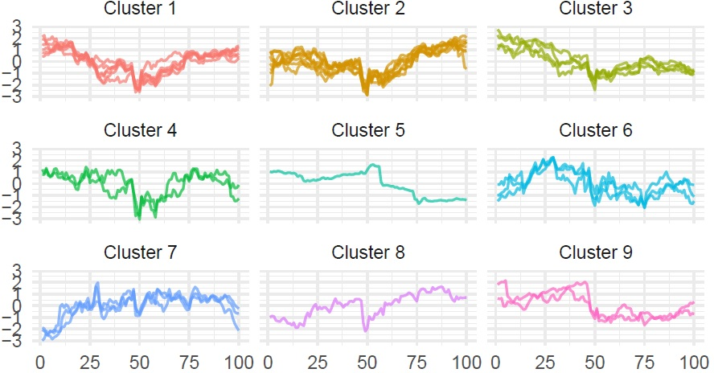

# Functional Data Analysis repository

<!-- badges: start -->

<!-- badges: end -->

This repository provides a comprehensive exploration of Functional Data
Analysis (FDA) which is a modern branch of statistics that models entire
data trajectories as realizations of underlying functions, rather than
as isolated multivariate points. By shifting perspective from discrete
observations to continuous functional objects, FDA opens the door to
more nuanced insights in fields ranging from biomedical research and
environmental science to finance and engineering.

Designed as both a learning resource and a practical toolkit, this
repository is aimed at:

- Undergraduate and graduate students seeking an accessible entry point
  into FDA;

- Researchers who wish to incorporate FDA techniques into applied or
  theoretical projects;

- Data science practitioners looking to move beyond traditional
  multivariate approaches and capture the dynamics of complex,
  high-dimensional data.

By visiting the website
(`vadimtyuryaev.github.io/Functional-Data-Analysis/`) and actively
engaging with the derivations and code, you will:

1.  Grasp the **core concepts of FDA**, understanding how it differs
    from classical statistics by treating observations as smooth
    functions residing in Hilbert spaces.

2.  Learn the difference between **interpolation and smoothing**.

3.  Explore **basis function expansions**, including detailed examples
    of what **Fourier series** and **B-splines** are and how they are
    used to represent discrete data points as continuous curves.

4.  Implement Functional Clustering, walking through an application of
    **Hierarchical Agglomerative Clustering (HAC)** on the price curves
    of DJIA stocks to identify market sectors.

5.  Explore how two widely used numerical methods, **ODE solvers (RKF45)
    and Nonlinear Least Squares (NLS)**, operate at the algorithmic
    level.

6.  Understand modern advances in parameter estimation such as
    **Generalized Profiling (GP)** for systems of nonlinear differential
    equations.

# References

Blanchard, Philippe, and Erwin Brüning. 2015. “Inner Product Spaces and
Hilbert Spaces.” In *Mathematical Methods in Physics: Distributions,
Hilbert Space Operators, Variational Methods, and Applications in
Quantum Physics*, 213–25. Springer International Publishing.
<https://doi.org/10.1007/978-3-319-14045-2_15>.

Dash, M., H. Liu, P. Scheuermann, and K. Tan. 2003. “Fast Hierarchical
Clustering and Its Validation.” *Data & Knowledge Engineering* 44:
109–38. <https://doi.org/10.1016/S0169-023X(02)00138-6>.

Ferreira, Laura, and David B. Hitchcock. 2009. “A Comparison of
Hierarchical Methods for Clustering Functional Data.” *Communications in
Statistics - Simulation and Computation* 38 (9): 1925–49.
<https://doi.org/10.1080/03610910903168603>.

Gautschi, Walter. 2011. *Numerical Analysis*. Birkhäuser Basel.
<https://link.springer.com/book/10.1007/978-0-8176-8259-0>.

Gradshteyn, I. S., and I. M. Ryzhik. 2014. *Table of Integrals, Series,
and Products*. Edited by Daniel Zwillinger. 8th ed. Amsterdam: Academic
Press.
<https://www.sciencedirect.com/book/9780123849335/table-of-integrals-series-and-products>.

Hubert, Lawrence, and Phipps Arabie. 1985. “Comparing Partitions.”
*Journal of Classification* 2 (1): 193–218.
<https://doi.org/10.1007/BF01908075>.

Moré, Jorge J. 1978. “The Levenberg-Marquardt Algorithm: Implementation
and Theory.” In *Numerical Analysis*, edited by G. A. Watson,
630:105–16. Lecture Notes in Mathematics. Berlin, Heidelberg: Springer.
<https://doi.org/10.1007/BFb0067700>.

Müller, Hans-Georg. 2022. “Special Issue on ‘Functional and Object Data
Analysis’: Guest Editor’s Introduction.” *Canadian Journal of
Statistics* 50. <https://doi.org/10.1002/cjs.11690>.

Park, Y., L. Reichel, G. Rodriguez, and X. Yu. 2018. “Parameter
Determination for Tikhonov Regularization Problems in General Form.”
*Journal of Computational and Applied Mathematics* 343: 12–25.
<https://doi.org/10.1016/j.cam.2018.04.017>.

Patrikalakis, Nicholas M., Shin Maekawa, and Takashi Cho. 2009. “Section
1.4: Bspline Curves and Surfaces.”
<https://web.mit.edu/hyperbook/Patrikalakis-Maekawa-Cho/>.

Postnikov, E. B., and O. V. Titkova. 2016. “A Correspondence Between the
Models of Hodgkin-Huxley and FitzHugh-Nagumo Revisited.” *The European
Physical Journal Plus* 131: 411.
<https://doi.org/10.1140/epjp/i2016-16411-1>.

Ramsay, J. O., Giles Hooker, D. Campbell, and J. Cao. 2007. “Parameter
Estimation for Differential Equations: A Generalized Smoothing
Approach.” *Journal of the Royal Statistical Society: Series B
(Statistical Methodology)* 69 (5): 741–96.
<https://doi.org/10.1111/j.1467-9868.2007.00610.x>.

Ramsay, J. O., and B. W. Silverman. 2001. “Functional Data Analysis.” In
*International Encyclopedia of the Social & Behavioral Sciences*, edited
by Neil J. Smelser and Paul B. Baltes, 5822–28. Oxford: Elsevier.
<https://doi.org/10.1016/B0080430767/00434-4>.

———. 2005. *Functional Data Analysis, 2nd*. New York: Springer.
<https://doi.org/10.1002/0471667196.ess3138>.

Ramsay, James O., Giles Hooker, and Spencer Graves. 2009. *Functional
Data Analysis with r and MATLAB*. Use r! New York: Springer.
<https://doi.org/10.1007/978-0-387-98185-7>.

Rand, William M. 1971. “Objective Criteria for the Evaluation of
Clustering Methods.” *Journal of the American Statistical Association*
66 (336): 846–50. <https://doi.org/10.2307/2284239>.

Shahriari, Bobak, Kevin Swersky, Ziyu Wang, Ryan P. Adams, and Nando de
Freitas. 2016. “Taking the Human Out of the Loop: A Review of Bayesian
Optimization.” *Proceedings of the IEEE* 104 (1): 148–75.
<https://doi.org/10.1109/JPROC.2015.2494218>.

Shampine, Lawrence F. 1986. “Some Practical Runge–Kutta Formulas.”
*Mathematics of Computation* 46 (173): 135–50.
<https://doi.org/10.2307/2008219>.

Weisstein, Eric W. 2002. “Fourier Series.”
<https://mathworld.wolfram.com/FourierSeries.html>.

Xu, Hongyan. 2020. “Chapter 7 - Big Data Challenges in Genomics.” In
*Principles and Methods for Data Science*, edited by Arni S. R.
Srinivasa Rao and C. R. Rao, 43:337–48. Handbook of Statistics.
Elsevier. https://doi.org/<https://doi.org/10.1016/bs.host.2019.08.002>.

