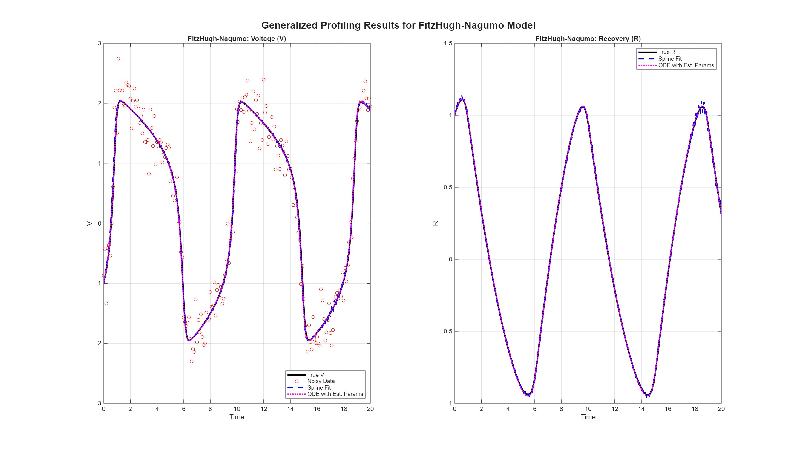

# SETUP AND LIBRARIES

```{r setup, warning=FALSE, message=FALSE}

if (!require(pacman)) install.packages("pacman")
pacman::p_load(
  tidyquant,         # To get stock data and DJIA components
  fda.usc,           # Functional data utilities (for fdata objects)
  flexclust,         # For calculating Rand Index
  dendextend         # For beautiful dendrograms
)

library(fda)         # Functional data objects, smoothing, basis expansions
library(fdacluster)  # Clustering methods tailored for functional data
library(ggplot2)     # Grammar-of-graphics plotting
library(polynom)     # Polynomial objects and operations
library(splines)     # B-splines, natural splines, spline design matrices
library(dplyr)       # Data manipulation 
library(tidyr)       # Data tidying (pivoting, separating, uniting columns)
library(purrr)       # Functional programming (map/reduce over lists)
library(mclust)      # Model-based clustering, Gaussian mixtures, BIC selection
library(tidyquant)   # Tidy tools for financial time series and stock data
library(fda.usc)     # Extended FDA methods: regression, depth, outlier detection
library(flexclust)   # Flexible clustering (k-centroids, k-medoids, EM variants)
library(dendextend)  # Dendrogram manipulation and visualization
library(latex2exp)   # Parse LaTeX math to plotmath for ggplot/base graphics
library(gridExtra)   # Arrange multiple ggplot2 plots on a page
library(grid)        # Low-level grid graphics system
library(knitr)       # Reproducible reports; knitting R/markdown to outputs
library(kableExtra)  # Enhanced tables for LaTeX/HTML (formatting, styling)

```

# FOUNDATIONS

## What Is FDA?

Functional data analysis (FDA) is a modern repertoire of statistical methods
designed for situations where data are best understood as smooth curves rather
than as isolated points or finite-dimensional vectors. In this 
framework each observation is treated not as a scalar or a vector but as
a realization of a real-valued function $x_i(t)$ defined over a continuous 
domain b$\mathcal{T}\subset\mathbb{R}$. This perspective reflects the fact that
many empirical phenomena—such as growth trajectories, temporal dynamics in 
epidemiological studies, or spectral measurements—are naturally continuous. 

A key assumption underlying FDA is that the function $x(t)$ possesses a
sufficient degree of smoothness. If this condition is not satisfied, then the 
advantages of functional methods are lost and conventional multivariate analysis 
is generally more appropriate. 

FDA extends many classical multivariate  techniques, including principal 
components analysis (PCA) and linear models, to the functional domain, offering 
tools to identify low-dimensional structure and dynamic relationships in data 
that live in infinite-dimensional spaces. 

## Goals and Distinctions of FDA

The goals of functional data analysis parallel the central objectives of
classical statistics while adapting them to the functional setting. Broadly 
speaking, FDA seeks to represent and transform raw data into functional objects
(curves) that can be subjected to further investigation; to visualize these 
objects in ways that highlight important patterns and dynamics across the domain;
to characterize and interpret systematic sources of variation among curves;
and to model and explain variation in a response variable when functional 
predictors or covariates are present. These aims ensure that FDA serves not
only as a descriptive tool but also as a framework for inferential modeling and
prediction.  

The methodological foundations of FDA rely on several key mathematical and
computational ideas. At the theoretical level, FDA is grounded in Hilbert
space methods, which provide the geometric structure needed to treat functions
as data objects. In practice, functions are commonly represented through basis 
expansions, such as  [Generalized Fourier Series](https://mathworld.wolfram.com/GeneralizedFourierSeries.html) 
or [B-splines](https://personal.math.vt.edu/embree/math5466/lecture10.pdf), which 
allow infinite-dimensional functions to be approximated in finite-dimensional spaces.
To avoid [overfitting](https://developers.google.com/machine-learning/crash-course/overfitting/overfitting) 
and ensure stable estimation, FDA also makes extensive use of [regularization](https://www.ibm.com/think/topics/regularization) techniques, which balance fidelity to the observed data with smoothness of the 
estimated functions. 

# FUNCTIONAL SPACE AND GENERALIZAED FOURIER SERIES

## Hilbert Space and Square-Integrable Functions

A **Hilbert space** is a vector space $\mathcal{H}$ over $\mathbb{R}$ or 
$\mathbb{C}$ equipped with an inner product 
\[
\langle f,g \rangle : \mathcal{H} \times \mathcal{H} \to \mathbb{R} \ \ (\text{or } \mathbb{C}),
\]
such that the induced norm $\|f\| = \sqrt{\langle f,f \rangle}$ makes $\mathcal{H}$ into a complete metric space. 
That is, every Cauchy sequence $\{f_n\}$ in $\mathcal{H}$ converges to an element $f \in \mathcal{H}$. 

In FDA, each function $x_i(t)$ is modeled as an element of $L^2([a, b])$,  the
space of **square-integrable functions**:
  $$
  L^2([a,b]) = \{f : \int_a^b |f(t)|^2 dt < \infty \}
  $$

Note here that all Hilbert spaces are functional spaces, however, not all functional 
spaces are Hilbert spaces.

## Example: $f(t) = t + \cos(t)$ on $[-\pi, \pi]$

- To check whether \( f(t) = t + \cos(t) \) belongs to \( L^2([-\pi, \pi]) \):
  \[
  \int_{-\pi}^{\pi} |f(t)|^2 \, dt = \int_{-\pi}^{\pi} \left(t + \cos(t)\right)^2 \, dt
  \]
  Expand the square:
  \[
  \int_{-\pi}^{\pi} \left(t + \cos(t)\right)^2 \, dt = \int_{-\pi}^{\pi} \left(t^2 + 2t\cos(t) + \cos^2(t)\right) \, dt
  \]
  Break into parts:
  \[
 \begin{aligned}
 \int_{-\pi}^{\pi} t^2 \, dt = \frac{t^3}{3} \Biggr|_{-\pi}^{\pi} &= \frac{2\pi^3}{3} \\
 \int_{-\pi}^{\pi} 2t\cos(t) \, dt = [2t\sin(t)]\Biggr|_{-\pi}^{\pi} -  2\int_{-\pi}^{\pi} \sin(t) \, dt &= 0 \\
 \int_{-\pi}^{\pi} \cos^2(t) \, dt =  \int_{-\pi}^{\pi}\frac{1+cos(2t)}{2} &= \pi
 \end{aligned}
  \]
  Therefore:
  \[
  \int_{-\pi}^{\pi} |f(t)|^2 \, dt = \frac{2\pi^3}{3} + \pi = \frac{2\pi^3 + 3\pi}{3} < \infty
  \Rightarrow f \in L^2([-\pi, \pi])
  \]

## Orthogonal Basis

- The standard Fourier basis is $\{1,cos(t), sin(t),cos(2t), sin(2t), \ldots\}$:
  \[
  \phi_0(t) = 1,\quad
  \phi_{2k-1}(t) = \cos(kt),\quad
  \phi_{2k}(t) = \sin(kt)
  \]
  
- The basis forms a complete orthogonal system over $[-\pi, \pi]$: 
\[
\langle \phi_m, \phi_n \rangle = \int_{-\pi}^{\pi} \phi_m(t)\, \phi_n(t)\, dt =
\begin{cases}
0, & \text{if } m \ne n \\
\pi, & \text{if } m = n > 0 \\
 2\pi, & \text{if } m = n = 0
\end{cases}
\]

- The above is based on the following [integral identities](https://mathworld.wolfram.com/FourierSeries.html):
\[
\begin{aligned}
\int_{-\pi}^{\pi} \sin(mt)\sin(nt)\, dt &= \pi \delta_{mn}, \\
\quad \int_{-\pi}^{\pi} \cos(mt)\cos(nt)\, dt &= \pi \delta_{mn} \\
\int_{-\pi}^{\pi} \sin(mt)\cos(nt)\, dt &= 0, \\
\quad \quad \int_{-\pi}^{\pi} \sin(mt)\, dt &= 0,\\
\quad \int_{-\pi}^{\pi} \cos(mt)\, dt &= 0
\end{aligned}
\]
where \( \delta_{mn} \) is the Kronecker delta and \( m, n \ne 0 \).

## Generalized Fourier Series

- Thus, any periodic \( f \in L^2([-\pi, \pi]) \) can be decomposed as:
  \[
  f(t) = \frac{a_0}{2} + \sum_{n=1}^{\infty} \left[a_n \cos(nt) + b_n \sin(nt)\right]
  \]
  with Fourier coefficients calculated in the following manner:
  \[
  \begin{aligned}
  a_n = \frac{1}{\pi} \int_{-\pi}^{\pi} f(t) \cos(nt)\,dt \quad (n = 0, 1, 2, \ldots) \\
  b_n = \frac{1}{\pi} \int_{-\pi}^{\pi} f(t) \sin(nt)\,dt \quad (n = 1, 2, 3, \ldots)
  \end{aligned}
  \]
  
- Any periodic \( g \in L^2([-l, l]) \) can be expressed in as: 
\[
g(t) = \frac{a_0}{2} + \sum_{k=1}^{\infty} \left( a_k \cos\left( \frac{k\pi t}{l} \right) + b_k \sin\left( \frac{k\pi t}{l} \right) \right)
\]
the the Fourier coefficients which are given by the formulas:
\[
\begin{aligned}
a_k &= \frac{1}{l} \int_{-l}^{l} f(t) \cos\left( \frac{k\pi t}{l} \right)\,dt \quad (k = 0, 1, 2, \ldots) \\
b_k &= \frac{1}{l} \int_{-l}^{l} f(t) \sin\left( \frac{k\pi t}{l} \right)\,dt  \quad (k = 1, 2, 3 \ldots)
\end{aligned}
\]

## First Fourier Coefficients of \( f(t) = t + \cos(t) \)

- Zeroth coefficient:
  \[
  a_0 = \frac{1}{\pi} \int_{-\pi}^{\pi} f(t)\,dt = \frac{1}{\pi} \left[ \int_{-\pi}^{\pi} t\,dt + \int_{-\pi}^{\pi} \cos(t)\,dt \right] = 0
  \] \vspace{0.3cm}

- First cosine coefficient:
  \[
  \begin{aligned}
a_1 = \frac{1}{\pi} \int_{-\pi}^{\pi} f(t)\cos(t)\,dt = \frac{1}{\pi} \left[ \int_{-\pi}^{\pi} t\cos(t)\,dt + \int_{-\pi}^{\pi} \cos^2(t)\,dt \right] = \frac{1}{\pi} \left[ 0 + \pi \right] \ = 1
  \end{aligned}
  \] \vspace{0.3cm}

- First sine coefficient:
\[
 \begin{aligned}
b_1 = \frac{1}{\pi} \left[ \int_{-\pi}^{\pi} t\sin(t)\,dt + \int_{-\pi}^{\pi} \cos(t)\sin(t)\,dt \right] = \frac{1}{\pi} \left[ 2\pi + 0 \right] \ = 2
  \end{aligned}
\]

## Second Fourier Coefficients of \( f(t) = t + \cos(t) \)

- Second cosine coefficient:
\[
\begin{aligned}
a_2 = \frac{1}{\pi} \int_{-\pi}^{\pi} f(t)\cos(2t)\,dt =\frac{1}{\pi} \left[ \int_{-\pi}^{\pi} t\cos(2t)\,dt + \int_{-\pi}^{\pi} \cos(t)\cos(2t)\,dt \right]= \frac{1}{\pi} \left[ 0 + 0 \right] &= 0
\end{aligned}
\] \vspace{0.3cm}

- Second sine coefficient:
\[
\begin{aligned}
b_2 = \frac{1}{\pi} \int_{-\pi}^{\pi} f(t)\sin(2t)\,dt =\frac{1}{\pi} \left[ \int_{-\pi}^{\pi} t\sin(2t)\,dt + \int_{-\pi}^{\pi} \cos(t)\sin(2t)\,dt \right]= \frac{1}{\pi} \left[ -\pi + 0 \right] &= -1
\end{aligned}
\]

## Computational Approximation of $f(t)$ on $[-\pi, \pi]$

```{r, fig.width=8, fig.height=6,  fig.align='center', warning=FALSE, message=FALSE}

# Define domain and function
t = seq(-pi, pi, length.out = 1000)
f_true = t + cos(t)

# Correct shape: rows = values, columns = replications
y_matrix = matrix(f_true, ncol = 1)

# Function to compute approximation
compute_fd = function(nbasis) {
  basis = create.fourier.basis(rangeval = c(-pi, pi), nbasis = nbasis)
  fd = Data2fd(argvals = t, y = y_matrix, basisobj = basis)
  eval.fd(t, fd)
}

# Evaluate at different resolutions
f_10 = compute_fd(21)     # ~10 sines/cosines (plus constant)
f_25 = compute_fd(51)     # ~25 sines/cosines (plus constant)
f_50 = compute_fd(101)    # ~50 sines/cosines (plus constant)

# Prepare for plotting
df = data.frame(
  t = rep(t, 4),
  value = c(f_10, f_25, f_50, f_true),
  type = factor(rep(c("n = 10", "n = 25", "n = 50", "f(t)"), each = length(t)))
)

df$type = factor(df$type, levels = c("n = 10", "n = 25", "n = 50", "f(t)"))

ggplot(df, aes(x = t, y = value, color = type)) +
  geom_line(size = 1) +
  labs(y = "f(t) = t + cos(t)", x = "t") +
  theme_minimal(base_size=10)+
  theme(plot.title = element_text(hjust = 0.5), 
        legend.position = "right",
        legend.box = "vertical",
        axis.title = element_text(size = 8),
        axis.text = element_text(size = 8),
        legend.title = element_text(size = 8),
        legend.text = element_text(size = 8))

```

It is important to note that, under suitable regularity conditions, any 
square-integrable function can be approximated arbitrarily well in the $L^2$ 
sense by a Fourier series expansion. However, a fundamental limitation arises 
when the underlying function is not periodic. In such cases, the Fourier 
representation implicitly enforces periodicity by attempting to connect the 
endpoint of the interval with its beginning. This artificial periodic extension
often introduces discontinuities at the boundaries, a phenomenon that manifests
as oscillations near the edges of the interval, commonly referred to
as the **Gibbs phenomenon**. This limitation reflects the fact that Fourier series 
are intrinsically designed for periodic phenomena.

# POLYNOMIALS

## Interpolation vs. Smoothing

- **Interpolation**: fit $f$ such that $f(t_i) = y_i$
- **Smoothing**: fit $f$ such that
  $$\min_f \sum_{i=1}^n (y_i - f(t_i))^2 + \lambda \int (f''(t))^2 dt$$
  
- Why add regularization term?
  - Large values of $f''(t)$ indicate rapid curvature or oscillation.
  - Penalizing $\int (f''(t))^2 dt$ discourages overfitting to noise and promotes smoothness.
  - Larger $\lambda$ results in smoother fits.

## Lagrange Polynomials

- Given $n+1$ distinct interpolation points $t_0, t_1, \dots, t_n$ and function values $y_0, y_1, \dots, y_n$, the **Lagrange interpolation polynomial** $P_n(t)$ is defined by:
  \[
P_n(t) = \sum_{j=0}^n y_j \ell_j(t)
  \]
where the **Lagrange basis polynomials** $\ell_j(t)$ are:
\[
\ell_j(t) = \prod_{\substack{0 \leq m \leq n \\ m \neq j}} \frac{t - t_m}{t_j - t_m}
\]

- Each $\ell_j(t)$ satisfies:
  - $\ell_j(t_k) = \delta_{jk}$ ([Kronecker delta](https://www.sciencedirect.com/topics/engineering/kronecker-delta))
  - $\deg(\ell_j) = n$

## Lagrange Polynomial for $f(t)=3e^{-t^2}$

We choose three nodes: \( t_0 = -2,\ t_1 = 0,\ t_2 = 2 \)

The interpolating polynomial of degree $n=2$ is defined as:
\[
P_2(t) = \sum_{i=0}^2 f(t_i) \cdot \ell_i(t)
\]
Lagrange basis polynomials:
\[
\begin{aligned}
\ell_0(t) = \frac{(t - t_1)(t - t_2)}{(t_0 - t_1)(t_0 - t_2)} =\frac{(t)(t - 2)}{(-2)(-2 - 2)} &=  \frac{t(t - 2)}{8}  \\
\ell_1(t) = \frac{(t - t_0)(t - t_2)}{(t_1 - t_0)(t_1 - t_2)} =\frac{(t - (-2))(t - 2)}{(0-(-2))(0 - 2)} &=-\frac{(t + 2)(t - 2)}{4} \\
\ell_2(t) = \frac{(t - t_0)(t - t_1)}{(t_2 - t_0)(t_2 - t_1)} =\frac{(t - (-2))(t )}{(2 - (-2))(2)} &=  \frac{t(t + 2)}{8}
\end{aligned}
\]
Function values:
\[
f(-2) = 3e^{-4} = e \approx 0.054947,\quad f(0) = 3,\quad f(2) = 3e^{-4} \approx 0.054947
\]
Interpolating polynomial:
\[
P(t) = 3e^{-4} \cdot \frac{t(t - 2)}{8} 
- 3\frac{(t + 2)(t - 2)}{4} 
+ 3e^{-4} \cdot \frac{t(t + 2)}{8}
\]

## Quadratic Polynomial Interpolation: $P_2(t)$ at t = -2,0,2

```{r, fig.width=8, fig.height=6,  fig.align='center', warning=FALSE, message=FALSE}

# Use Gaussian (bell curve) function
f = function(t) 3*exp(-t^2)

# Evenly spaced sample points in [-2, 2]
t_sample = c(-2,0,2)
y_sample = f(t_sample)

# Define Lagrange basis
lagrange_basis = function(x, i, x_vals) {
  prod((x - x_vals[-i]) / (x_vals[i] - x_vals[-i]))
}

# Evaluate Lagrange interpolant
eval_lagrange = function(x, x_vals, y_vals) {
  sapply(x, function(x0) {
    sum(sapply(1:length(x_vals), function(i)
      y_vals[i] * lagrange_basis(x0, i, x_vals)))
  })
}

# Evaluation grid extended for extrapolation
x_plot = seq(-2.5, 2.5, length.out = 800)
y_interp = eval_lagrange(x_plot, t_sample, y_sample)
y_true = f(x_plot)

# Mark extrapolated points
x_extrap = c(-2.5, -2.25, 2.25, 2.5)
y_extrap_true = f(x_extrap)

# Plot data for lines
plot_df = data.frame(
  x = rep(x_plot, 2),
  y = c(y_interp, y_true),
  type = rep(c("Polynomial", "f(t)"), each = length(x_plot))
)
# Order for drawing and legend
plot_df$type = factor(plot_df$type, levels = c("f(t)", "Polynomial"))

#  CHANGE 1: Use "Sample" 
plot_points = data.frame(
  x = t_sample,
  y = y_sample,
  type = "Sample" 
)

#  CHANGE 2: Update factor levels 
plot_points$type = factor(plot_points$type, levels = c("Sample", "Extrapolated"))

# Define colors, shapes, and linetypes
colors = c("Polynomial" = "orange", "f(t)" = "black")
linetypes = c("f(t)" = "solid", "Polynomial" = "dashed")

#  CHANGE 3: Update shape names 
shapes = c("Sample" = 16, "Extrapolated" = 17) 

# Plot
p = ggplot(plot_df, aes(x = x, y = y)) +
  # Map color and linetype to the 'type' column in plot_df
  geom_line(aes(color = type, linetype = type), linewidth = 1) +
  
  # Add the sample points (red dots)
  geom_point(data = plot_points, aes(shape = type), color = "red", size = 2.5) +
  
  #  CHANGE 4: Use "Extrapolated" 
  geom_point(data = data.frame(x = x_extrap, y = y_extrap_true,
                               type = "Extrapolated"),
             aes(shape = type), color = "red", size = 3) +
  
  # Manual scales for appearance
  scale_color_manual(values = colors) +
  scale_shape_manual(values = shapes) +
  scale_linetype_manual(values = linetypes) +
  
  # Assign different titles to aesthetics for separate legends
  labs(
    x = "t",
    y = TeX("$f(t) = 3e^{-t^2}$"),
    color = "Function Type",
    linetype = "Function Type",
    shape = "Point Type"
  ) +
  
  theme_minimal(base_size = 10) +
  theme(plot.title = element_text(hjust = 0.5), 
        legend.position = "right",
        legend.box = "vertical",
        axis.title = element_text(size = 8),
        axis.text = element_text(size = 8),
        legend.title = element_text(size = 8),
        legend.text = element_text(size = 8))

print(p)

#P0 = poly.calc(t_sample, y_sample)

```

## $P_9(t)$ Using Ten Evenly Space Points

```{r, echo=FALSE,fig.width=8, fig.height=6,  fig.align='center', warning=FALSE, message=FALSE}

# Use Gaussian (bell curve) function
f = function(t) 3*exp(-t^2)

# Evenly spaced sample points in [-2, 2]
t_sample = seq(-2, 2, length.out = 10)
y_sample = f(t_sample)

# Evaluation grid extended for extrapolation
x_plot = seq(-2.5, 2.5, length.out = 800)
y_interp = eval_lagrange(x_plot, t_sample, y_sample)
y_true = f(x_plot)

# Mark extrapolated points
x_extrap = c(-2.5, -2.25, 2.25, 2.5)
y_extrap_true = f(x_extrap)

# Plot data for lines
plot_df = data.frame(
  x = rep(x_plot, 2),
  y = c(y_interp, y_true),
  type = rep(c("Polynomial", "f(t)"), each = length(x_plot))
)
# Order for drawing and legend
plot_df$type = factor(plot_df$type, levels = c("f(t)", "Polynomial"))

#  CHANGE 1: Use "Sample" 
plot_points = data.frame(
  x = t_sample,
  y = y_sample,
  type = "Sample" 
)

#  CHANGE 2: Update factor levels 
plot_points$type = factor(plot_points$type, levels = c("Sample", "Extrapolated"))

# Define colors, shapes, and linetypes
colors = c("Polynomial" = "orange", "f(t)" = "black")
linetypes = c("f(t)" = "solid", "Polynomial" = "dashed")

#  CHANGE 3: Update shape names 
shapes = c("Sample" = 16, "Extrapolated" = 17) 

# Plot
p = ggplot(plot_df, aes(x = x, y = y)) +
  # Map color and linetype to the 'type' column in plot_df
  geom_line(aes(color = type, linetype = type), linewidth = 1) +
  
  # Add the sample points (red dots)
  geom_point(data = plot_points, aes(shape = type), color = "red", size = 2.5) +
  
  #  CHANGE 4: Use "Extrapolated" 
  geom_point(data = data.frame(x = x_extrap, y = y_extrap_true,
                               type = "Extrapolated"),
             aes(shape = type), color = "red", size = 3) +
  
  # Manual scales for appearance
  scale_color_manual(values = colors) +
  scale_shape_manual(values = shapes) +
  scale_linetype_manual(values = linetypes) +
  
  # Assign different titles to aesthetics for separate legends
  labs(
    x = "t",
    y = TeX("$f(t) = 3e^{-t^2}$"),
    color = "Function Type",
    linetype = "Function Type",
    shape = "Point Type"
  ) +
  
  theme_minimal(base_size = 10) +
  theme(plot.title = element_text(hjust = 0.5), 
        legend.position = "right",
        legend.box = "vertical",
        axis.title = element_text(size = 8),
        axis.text = element_text(size = 8),
        legend.title = element_text(size = 8),
        legend.text = element_text(size = 8))

print(p)

#P1 = poly.calc(t_sample, y_sample)

```

## $P_9(t)$ Using Ten Randomly Selected Points

```{r, echo=FALSE,fig.width=8, fig.height=6,  fig.align='center', warning=FALSE, message=FALSE}

# Use Gaussian (bell curve) function
f = function(t) 3*exp(-t^2)

# Set seed for reproducibility of random points
set.seed(47)

# Generate 10 random sample points in [-2, 2] and sort them
t_sample = sort(runif(10, -2, 2))
y_sample = f(t_sample)

# Evaluation grid for plotting the functions
#x_plot = seq(-2.25, 2.25, length.out = 800)
x_plot = seq(-2.5, 2.5, length.out = 800)
y_interp = eval_lagrange(x_plot, t_sample, y_sample)
y_true = f(x_plot)

# Define points for extrapolation visualization
#x_extrap = c(-1.75, -2.25, 2.25, 1.75)
x_extrap = c(-2.5, -2.25, 2.25, 2.5)
y_extrap_true = f(x_extrap)

# Data frame for the line plots (True Function and Polynomial)
plot_df = data.frame(
  x = rep(x_plot, 2),
  y = c(y_interp, y_true),
  type = rep(c("Polynomial", "f(t)"), each = length(x_plot))
)
# Set factor order for correct legend and drawing order
plot_df$type = factor(plot_df$type, levels = c("f(t)", "Polynomial"))

# Data frame for the sample points
plot_points = data.frame(
  x = t_sample,
  y = y_sample,
  type = "Sample" 
)

# Define colors, shapes, and linetypes to match the target style
colors = c("Polynomial" = "orange", "f(t)" = "black")
linetypes = c("f(t)" = "solid", "Polynomial" = "dashed")
shapes = c("Sample" = 16, "Extrapolated" = 17)

# Generate the plot
p = ggplot(plot_df, aes(x = x, y = y)) +
  # Plot the lines, mapping color and linetype to the 'type' column
  geom_line(aes(color = type, linetype = type), linewidth = 1) +
  
  # Add the sample points
  geom_point(data = plot_points, aes(shape = type), color = "red", size = 2.5) +
  
  # Add the extrapolated points (defined inline)
  geom_point(data = data.frame(x = x_extrap, y = y_extrap_true, type = "Extrapolated"),
             aes(shape = type), color = "red", size = 3) +
  
  # Apply manual scales for appearance
  scale_color_manual(values = colors) +
  #  ADJUSTMENT: Use `limits` to set the legend order for shapes 
  scale_shape_manual(values = shapes, limits = c("Sample", "Extrapolated")) +
  scale_linetype_manual(values = linetypes) +
  
  # Assign titles to aesthetics to create and format separate legends
  labs(
    x = "t",
    y = TeX("$f(t) = 3e^{-t^2}$"),
    color = "Function Type",
    linetype = "Function Type",
    shape = "Point Type"
  ) +
  
  # Apply theme settings
  theme_minimal(base_size = 10) +
  theme(plot.title = element_text(hjust = 0.5), 
        legend.position = "right", 
        legend.box = "vertical",
        axis.title = element_text(size = 8),
        axis.text = element_text(size = 8),
        legend.title = element_text(size = 8),
        legend.text = element_text(size = 8))

# Print the final plot
print(p)

#P2 = poly.calc(t_sample, y_sample)

```

## $P_{19}(t)$ Using Twenty Randomly Selected Points

```{r, echo=FALSE,fig.width=8, fig.height=6,  fig.align='center', warning=FALSE, message=FALSE}

# Use Gaussian (bell curve) function
f = function(t) 3*exp(-t^2)

# Set seed for reproducibility
set.seed(47)

# Generate 20 random sample points in [-2, 2] and sort them
t_sample = sort(runif(25, -2, 2))
y_sample = f(t_sample)

# Evaluation grid for plotting the functions
x_plot = seq(-2.5, 2.5, length.out = 800)
y_interp = eval_lagrange(x_plot, t_sample, y_sample)
y_true = f(x_plot)

# Extrapolation points
x_extrap = c(-2.5, -2.25, 2.25, 2.5)
y_extrap_true = f(x_extrap)

# Data frame for the line plots (True Function and Polynomial)
plot_df = data.frame(
  x = rep(x_plot, 2),
  y = c(y_interp, y_true),
  type = rep(c("Polynomial", "f(t)"), each = length(x_plot))
)
# Set factor order for correct legend and drawing order
plot_df$type = factor(plot_df$type, levels = c("f(t)", "Polynomial"))

# Data frame for the sample points
plot_points = data.frame(
  x = t_sample,
  y = y_sample,
  type = "Sample" 
)

# Define colors, shapes, and linetypes to match the target style
colors = c("Polynomial" = "orange", "f(t)" = "black")
linetypes = c("f(t)" = "solid", "Polynomial" = "dashed")
shapes = c("Sample" = 16, "Extrapolated" = 17)

# Generate the plot
p = ggplot(plot_df, aes(x = x, y = y)) +
  # Plot the lines, mapping color and linetype to the 'type' column
  geom_line(aes(color = type, linetype = type), linewidth = 1) +
  
  # Add the sample points
  geom_point(data = plot_points, aes(shape = type), color = "red", size = 2.5) +
  
  # Add the extrapolated points (defined inline)
  geom_point(data = data.frame(x = x_extrap, y = y_extrap_true, type = "Extrapolated"),
             aes(shape = type), color = "red", size = 3) +
  
  # Apply manual scales for appearance
  scale_color_manual(values = colors) +
  # Use `limits` to set the legend order for shapes
  scale_shape_manual(values = shapes, limits = c("Sample", "Extrapolated")) +
  scale_linetype_manual(values = linetypes) +
  
  # Assign titles to aesthetics to create and format separate legends
  labs(
    x = "t",
    y = TeX("$f(t) = 3e^{-t^2}$"),
    color = "Function Type",
    linetype = "Function Type",
    shape = "Point Type"
  ) +
  
  # Apply theme settings
  theme_minimal(base_size = 10) +
  theme(plot.title = element_text(hjust = 0.5), 
        legend.position = "right", 
        legend.box = "vertical",
        axis.title = element_text(size = 8),
        axis.text = element_text(size = 8),
        legend.title = element_text(size = 8),
        legend.text = element_text(size = 8))
 
# Print the final plot
print(p)

#P3 = poly.calc(t_sample, y_sample)

```

As can be observed, increasing the degree of the polynomial and ensuring that 
data points adequately span the domain of the target function generally leads 
to in-sample fits that closely resemble the function being modeled. However, 
this approach comes with a well-known drawback: high-degree polynomial fits
tend to be numerically unstable, particularly near the boundaries of the domain,
and may exhibit large oscillations when extrapolated beyond the range of the 
observed data. These occurrences, often associated with **Runge’s phenomenon**, 
highlights the limitations of polynomial interpolation for complex or 
non-uniformly distributed data.

## From Monomials to Basis Splines

- Lagrange polynomials and [similar techniques](https://engcourses-uofa.ca/introduction-to-numerical-analysis/polynomial-interpolation/)
focus on the approximation of a function over a finite interval, $[a,b]$, using a single polynomial (monomial). 

- This method guarantees that for functions with sufficient smoothness, the
**approximation error** can be made **arbitrarily small** by selecting a polynomial of
a sufficiently **high degree**.

- An alternative approach to controlling accuracy is partitioning the interval $[a,b]$ 
into a series of sub-intervals:
\[
a = x_1 < x_2 < x_3 < \dots < x_{n-1} < x_n = b
\]

- The function is approximated on each sub-interval $[x_i, x_{i+1}]$ (for $i = 1, 2, \dots, n-1$) 
using a separate, **low-degree polynomial**.

# B-SPLINES

## Theory

- A **B-spline** is a piecewise polynomial with local support, defined over knots $\{\tau_i\}$.
- B-splines $B_{j,m}(t)$ of degree $m$ satisfy:
  - Continuity up to $(m-1)$ derivatives.
  - Localized influence between $\tau_j$ and $\tau_{j+m+1}$.
  
- Local support (influence) means that the basis function $B_{j,m}(t)$ is non-zero only on the interval $[\tau_j,\tau_{j+m+1})$
  
- Functional representation:
  $$f(t) = \sum_{j=1}^{n} c_j B_{j,m}(t)$$
  with coefficients $c_j \in \mathbb{R}$ estimated from data.
  
- Because each control point $c_j$ is paired with a basis function $B_{j,m}(t)$, the **influence** of that control point is confined to the interval where its basis function is non-zero.

## Setup for B-spline Approximation

Let's say we want to approximate \( f(t) \) on \([-2, 2] \) using 2nd-degree B-splines.

- Degree \( m = 2 \), Order \( k = 3 \)
- Divide \([-2, 2]\) into 3 equal subintervals:
  \[
  [-2, -0.67],\ [-0.67, 0.67],\ [0.67, 2]
  \]
- Internal breakpoints: \( \xi = \{-0.67,\ 0.67\} \)

Construct a [**clamped knot vector**](https://web.mit.edu/hyperbook/Patrikalakis-Maekawa-Cho/node17.html) by repeating boundary knots:
\[
\tau = [-2, -2, -2, -0.67, 0.67, 2, 2, 2]
\]

Number of B-spline basis functions:
\[
n = \text{length}(\tau) - k = 8 - 3 = 5
\]

We will now compute several examples of basis functions \( B_{j,m}(t) \) for \( j = 1,\ldots,5 \) and \( m = 0,\ldots,2 \).

## Zeroth-Degree B-splines \( B_{j,0}(t) \)

Define the zeroth-degree polynomial as:
\[
B_{j,0}(t) =
\begin{cases}
1, & \tau_j \le t < \tau_{j+1} \\
0, & \text{otherwise}
\end{cases}
\]

With knots \( \tau = [-2, -2, -2, -0.67, 0.67, 2, 2, 2] \), the non-zero supports are:

- \( B_{3,0}(t) = 1 \) if \( -2 < t < -0.67 \)
- \( B_{4,0}(t) = 1 \) if \( -0.67 < t < 0.67 \)
- \( B_{5,0}(t) = 1 \) if \( 0.67 < t < 2 \)

Note: \( B_{1,0} \) and \( B_{2,0} \) are zero because \( \tau_1 = \tau_2 = \tau_3 = -2 \) are degenerate intervals. So are \( B_{6,0} \) and \(B_{7,0}\).

## Recursive formula

- From the 0-th degree B-splines, higher degree B-splines can be obtained via recurrence:\vspace{0.3cm}

\[
B_{j,k}(t) = \frac{t - \tau_j}{\tau_{j+k} - \tau_j} B_{j,k-1}(t) +
\frac{\tau_{j+k+1} - t}{\tau_{j+k+1} - \tau_{j+1}} B_{j+1,k-1}(t)
\] \vspace{0.3cm}

- This construction, while **far from obvious**, ensures that $B_{j,k}$ 
has one more continuous derivative than does $B_{j,k-1}$.\vspace{0.3cm}

- Therefore, while $B_{j,0}$ is discontinuous,  $B_{j,1}$ is continuous,
$B_{j,2} \in C^1(\mathbb{R})$, and $B_{j,3} \in C^2(\mathbb{R})$. 

## B-Splines Construction Logic Visualiation

```{r, fig.width=8, fig.height=6,  fig.align='center', warning=FALSE, message=FALSE}

#  1. DEFINE KNOTS AND PLOT-WIDE PARAMETERS 

knots_d0 = c(-2, -0.67, 0.67, 2)
knots_d1 = c(-2, -2, -0.67, 0.67, 2, 2)
knots_d2 = c(-2, -2, -2, -0.67, 0.67, 2, 2, 2)

x_range = c(-3, 3)
support_domain = c(-2, 2)
internal_knots = c(-0.67, 0.67)

#  2. FUNCTION TO GENERATE A PLOT FOR A GIVEN DEGREE 

generate_basis_plot = function(degree, knots, show_legend = FALSE) {
  
  k = degree + 1
  x_vals = seq(x_range[1], x_range[2], length.out = 501)
  
  basis_matrix = spline.des(knots, x_vals, k, 
                            derivs = rep(0, length(x_vals)),
                            outer.ok = TRUE)$design
  
  basis_df = as.data.frame(basis_matrix)
  names(basis_df) = paste0("B", 1:ncol(basis_df))
  basis_df$x = x_vals
  
  plot_data = basis_df %>%
    pivot_longer(cols = -x, names_to = "basis_id", values_to = "y") %>%
    mutate(
      basis_num = as.numeric(gsub("B", "", basis_id)),
      linetype_style = if_else(basis_num %% 2 == 1, "solid", "dotdash"),
      color_style = case_when(
        (basis_num - 1) %% 3 == 0 ~ "blue",
        (basis_num - 1) %% 3 == 1 ~ "yellow",
        TRUE ~ "green"
      )
    )
  
  #  HARDCODED LABEL DATA AS PER YOUR EXACT SPECIFICATIONS 
  label_data = data.frame()
  if (degree == 0) {
    label_data = data.frame(
      x_pos = c(-1.5, 0, 1.5),
      final_y = 1.5,
      label_text = c("B[list(3, 0)]", "B[list(4, 0)]", "B[list(5, 0)]")
    )
  } else if (degree == 1) {
    label_data = data.frame(
      x_pos = c(-2, -0.67, 0.67, 2),
      final_y = 1.5,
      label_text = c("B[list(2, 1)]", "B[list(3, 1)]", 
                     "B[list(4, 1)]", "B[list(5, 1)]")
    )
  } else if (degree == 2) {
    label_data = data.frame(
      x_pos = c(-2, -1, 0, 1, 2),
      final_y = 1.5,
      label_text = c("B[list(1, 2)]", "B[list(2, 2)]", "B[list(3, 2)]", 
                     "B[list(4, 2)]", "B[list(5, 2)]")
    )
  }
  
  plot_data_final = plot_data %>% mutate(y = if_else(y < 1e-9, NA_real_, y))

  #  Create the plot 
  p = ggplot(plot_data_final, aes(x = x, y = y, group = basis_id)) +
    
    geom_line(aes(linetype = linetype_style, color = color_style),
              linewidth = 1.2, na.rm = TRUE, show.legend = FALSE) +
    
    geom_point(
      data = data.frame(x = internal_knots, y = 0),
      aes(x = x, y = y, color = "Internal \n breakpoints"),
      shape = 4, size = 2, stroke = 1.2, inherit.aes = FALSE
    ) +
    
    scale_linetype_manual(values = c("solid" = "solid", "dotdash" = "dotdash")) +
    scale_color_manual(
        name = NULL,
        values = c(
            "blue" = "#0072B2", "yellow" = "#E69F00", "green" = "#009E73",
            "Internal \n breakpoints" = "red"
        ),
        breaks = c("Internal \n breakpoints")
    ) +
    
    # Added inherit.aes = FALSE to prevent the error
    geom_text(
      data = label_data, aes(x = x_pos, y = final_y, label = label_text),
      parse = TRUE, size = 4.5, color = "black", show.legend = FALSE, 
      inherit.aes = FALSE
    ) +
    
    geom_segment(
      aes(x = support_domain[1], xend = support_domain[2], 
          y = -0.05, yend = -0.05),
      inherit.aes = FALSE, color = "black", linewidth = 0.8
    ) +
    geom_segment(
      data = data.frame(x = c(internal_knots, support_domain)),
      aes(x = x, xend = x, y = -0.05, yend = -0.02),
      inherit.aes = FALSE, color = "black"
    ) +

    scale_y_continuous(limits = c(-0.1, 2), breaks = c(0, 0.5, 1)) +
    scale_x_continuous(limits = x_range, 
                       breaks = seq(x_range[1], x_range[2], by = 1)) +
    labs(y = "", x = "") +
    theme_classic() +
    theme(legend.position = if(show_legend) "right" else "none")
  
  return(p)
}

#  3. GENERATE AND ARRANGE THE PLOTS WITH A SHARED LEGEND 

get_legend = function(my_ggplot){
  tmp = ggplot_gtable(ggplot_build(my_ggplot))
  leg = which(sapply(tmp$grobs, function(x) x$name) == "guide-box")
  legend = tmp$grobs[[leg]]
  return(legend)
}

# Use a null PDF device to capture and discard any unwanted intermediate plots
plot_with_legend = generate_basis_plot(0, knots_d0, show_legend = TRUE)
shared_legend = get_legend(plot_with_legend)

# Generate the final plots for display
plot_d0 = generate_basis_plot(0, knots_d0)
plot_d1 = generate_basis_plot(1, knots_d1)
plot_d2 = generate_basis_plot(2, knots_d2)

Grob_obj = arrangeGrob( plot_d0, plot_d1, plot_d2, ncol = 1)

# Print the final arranged plot to the active graphics device
    grid.arrange(Grob_obj,
                 shared_legend,
                 ncol = 2,
                 widths = c(4, 1.2)) # Allocate sufficient width to the legend)

```

## First-Degree B-splines

**Use:**
\[
B_{j,1}(t) = \frac{t - \tau_j}{\tau_{j+1} - \tau_j} B_{j,0}(t) +
\frac{\tau_{j+2} - t}{\tau_{j+2} - \tau_{j+1}} B_{j+1,0}(t)
\]

to construct \( B_{3,1}(t) \) and \( B_{4,1}(t) \).

**\( B_{3,1}(t) \)**:

\[
\tau_3 = -2,\ \tau_4 = -0.67,\ \tau_5 = 0.67
\]
\[
B_{3,1}(t) = \frac{t + 2}{1.33} B_{3,0}(t) +
\frac{0.67 - t}{1.34} B_{4,0}(t)
\]

- Support:
  - First term: \( t \in (-2, -0.67) \)
  - Second term: \( t \in (-0.67, 0.67) \)

Resulting in a piecewise linear function (triangle) over \((-2, 0.67)\).

**\( B_{4,1}(t) \)**:

\[
\tau_4 = -0.67,\ \tau_5 = 0.67,\ \tau_6 = 2
\]
\[
B_{4,1}(t) = \frac{t + 0.67}{1.34} B_{4,0}(t) + 
\frac{2 - t}{1.33} B_{5,0}(t)
\]

- Support:
  - First term: \( t \in (-0.67, 0.67) \)
  - Second term: \( t \in (0.67, 2) \)

This function also forms a triangle over \((-0.67, 2)\).

## Second-Degree B-spline

**Now use**:
\[
B_{j,2}(t) = \frac{t - \tau_j}{\tau_{j+2} - \tau_j} B_{j,1}(t) +
\frac{\tau_{j+3} - t}{\tau_{j+3} - \tau_{j+1}} B_{j+1,1}(t)
\]

to construct \( B_{3,2}(t) \):

\[
B_{3,2}(t) = \frac{t + 2}{2.67} \cdot B_{3,1}(t) + 
\frac{2 - t}{2.67} \cdot B_{4,1}(t)
\]

Substitute from earlier results:

\[
B_{3,1}(t) = \frac{t + 2}{1.33} B_{3,0}(t) +
\frac{0.67 - t}{1.34} B_{4,0}(t)
\]
\[
B_{4,1}(t) = \frac{t + 0.67}{1.34} B_{4,0}(t) + 
\frac{2 - t}{1.33} B_{5,0}(t)
\]

**Putting it all together**:

\[
\begin{aligned}
B_{3,2}(t) &= \frac{t + 2}{2.67} \left[
\frac{t + 2}{1.33} B_{3,0}(t) + \frac{0.67 - t}{1.34} B_{4,0}(t)
\right] \\
&+ \frac{2 - t}{2.67} \left[
\frac{t + 0.67}{1.34} B_{4,0}(t) + \frac{2 - t}{1.33} B_{5,0}(t)
\right]
\end{aligned}
\]

- This yields a smooth, piecewise quadratic function over \([-2, 2]\).

## Constructed $B_{3,m}$ B-Splines Form

```{r, fig.width=8, fig.height=6,  fig.align='center', warning=FALSE, message=FALSE}

# Setup
t_vals = seq(-2, 2, length.out = 400)
knots = c(-2, -2, -2, -0.67, 0.67, 2, 2, 2)

# Helper function to extract B_{j,k}(t)
extract_basis = function(degree, basis_index) {
  ord = degree + 1
  n_basis = length(knots) - ord
  coefs = rep(0, n_basis)
  coefs[basis_index] = 1
  design_matrix = splineDesign(knots, t_vals, ord = ord)
  y_vals = design_matrix %*% coefs
  data.frame(t = t_vals, B_value = as.vector(y_vals),
             Label = paste0("B[", basis_index, ",", degree, "](t)"))
}

# Collect all degrees for B_{3,k}
# Note: R uses 1-based indexing, so B[3,k] corresponds to basis_index = 3
df_list = lapply(0:2, function(k) extract_basis(degree = k, basis_index = 3))
df_all = bind_rows(df_list)

# Plot with facets
ggplot(df_all, aes(x = t, y = B_value)) +
  geom_line(color = "orange", size = 1.2) +
  facet_wrap(~Label, ncol = 1, scales = "free_y") +
  labs( x = "t", y = "Value") +
  theme_minimal(base_size = 10) +
  theme(plot.title = element_text(hjust = 0.5), 
        legend.position = "right", 
        legend.box = "vertical",
        axis.title = element_text(size = 8),
        axis.text = element_text(size = 8),
        legend.title = element_text(size = 8),
        legend.text = element_text(size = 8))

```

## Constructed $B_{4,m}$ B-Splines Form

```{r, echo=FALSE,fig.width=8, fig.height=6,  fig.align='center', warning=FALSE, message=FALSE}

# Setup
t_vals = seq(-2, 2, length.out = 400)
knots = c(-2, -2, -2, -0.67, 0.67, 2, 2, 2)

# Helper function to extract B_{j,k}(t)
extract_basis = function(degree, basis_index) {
  order = degree + 1
  n_basis = length(knots) - order
  coefs = rep(0, n_basis)
  coefs[basis_index] = 1
  design_matrix = splineDesign(knots, t_vals, ord = order)
  y_vals = design_matrix %*% coefs
  data.frame(t = t_vals, B_value = as.vector(y_vals),
             Label = paste0("B[", basis_index, ",", degree, "](t)"))
}

# Generate B_{4,0}, B_{4,1}, B_{4,2}
# Since R is 1-based, B_{4,k} corresponds to basis_index = 5
df_list = lapply(0:2, function(k) extract_basis(degree = k, basis_index = 4))
df_all = bind_rows(df_list)

# Plot with facets
ggplot(df_all, aes(x = t, y = B_value)) +
  geom_line(color = "orange", linewidth = 1.2) +
  facet_wrap(~Label, ncol = 1, scales = "free_y") +
  labs(x = "t", y = "B-splines") +
  theme_minimal(base_size = 10) +
  theme(
    plot.title = element_text(hjust = 0.5),
    legend.position = "none",
    strip.text = element_text(size = 8),
    legend.title = element_text(size = 8),
    legend.text = element_text(size = 8),
    axis.title = element_text(size = 9),
    axis.text = element_text(size = 8)
  )


```

## B-spline Approximation of \( f(t) = 3e^{-t^2} \) on \([-2, 2]\)

We approximate:
\[
3e^{-t^2} \approx \sum_{j=1}^{5} c_j B_{j,2}(t)
\]

The coefficients \( c_j \) are computed by solving the least squares problem:
\[
\min_{c_1, \dots, c_5} \sum_{i=1}^n \left[ 3e^{-t_i^2} - \sum_{j=1}^{5} c_j B_{j,2}(t_i) \right]^2
\]

With penalization, the objective becomes (note that cubic splines are required):
\[
\min_{c_1, \dots, c_5} \sum_{i=1}^n \left[ 3e^{-t_i^2} - \sum_{j=1}^{5} c_j B_{j,3}(t_i) \right]^2
+ \lambda \int_{-2}^{2} \left( \left[ \sum_{j=1}^{5} c_j B_{j,3}''(t) \right]^2 \right) dt
\]

- If \( \lambda = 0 \): interpolation at the data points \( \{t_i\} \)
- If \( \lambda > 0 \): smoother approximation

## An Example of A Clamped Quadratic B-spline {.t}

```{r, fig.width=7, fig.asp=0.7, out.width="100%", fig.align='center', warning=FALSE, message=FALSE}

# 1.  DEFINE INPUTS 

# Update control point labels to be p1 through p5
control_points = data.frame(
  x = c(0, 1.5, 3.5, 6, 5.5),
  y = c(1, 3.5, 4, 2, -1),
  label = c(
    "paste(p[1], ' = ', t[1], ' = ', t[2], ' = ', t[3])", 
    "p[2]", 
    "p[3]", 
    "p[4]", 
    "paste(p[5], ' = ', t[6], ' = ', t[7], ' = ', t[8])"
  )
)
# Convert to a matrix for calculations
P_matrix = as.matrix(control_points[, c("x", "y")])

# Define B-spline parameters for a quadratic curve
d = 2             # Degree of the spline (quadratic)
n = nrow(control_points) - 1 # Number of control points - 1 (n=4)

# Use the specified clamped knot vector
knots = c(-2, -2, -2, -0.67, 0.67, 2, 2, 2)

# 2.  CALCULATE THE CURVE SPANS FOR COLORING 

# Get the unique knot values that define the span breaks
unique_knots = unique(knots)
all_spans_data = list()

# Loop through each span, calculate its points, and assign a span ID
for (i in 1:(length(unique_knots) - 1)) {
  t_start = unique_knots[i]
  t_end = unique_knots[i+1]
  
  # Generate parameter values for this specific span
  t_vals = seq(t_start, t_end, length.out = 100)
  
  # Calculate basis and curve points for the span
  basis_matrix = spline.des(knots, t_vals, d + 1, outer.ok = TRUE)$design
  curve_points_matrix = basis_matrix %*% P_matrix
  
  span_df = as.data.frame(curve_points_matrix)
  names(span_df) = c("x", "y")
  span_df$span_id = paste("Span", i) # Add identifier for coloring
  
  all_spans_data[[i]] = span_df
}

# Combine all span data into a single data frame
curve_points = do.call(rbind, all_spans_data)

# 3.  PREPARE DATA FOR PLOTTING LABELS 

# Identify the internal knots from the full knot vector
internal_knots_seq = knots[(d + 2):(n + 1)] # Gets knots c(-0.67, 0.67)

# Calculate the positions of the knot points (t4, t5) on the curve
knot_basis = spline.des(knots, internal_knots_seq, d + 1, outer.ok = TRUE)$design
knot_points_matrix = knot_basis %*% P_matrix
knot_points = as.data.frame(knot_points_matrix)
names(knot_points) = c("x", "y")
knot_points$label = paste0("t", (d + 2):(n + 1))

# Define a color palette for the spans
span_colors = c("Span 1" = "#66c2a5", "Span 2" = "#fc8d62", "Span 3" = "#8da0cb")


# 4.  GENERATE THE PLOT 

ggplot() +
  # Draw the control polygon
  geom_path(data = control_points, aes(x = x, y = y), linetype = "dashed",
            color = "gray40") +
  
  #  CHANGE: Draw the B-spline curve and enable the color legend 
  geom_path(data = curve_points, aes(x = x, y = y, color = span_id, group = span_id), 
            linewidth = 1.2) +
            
  #  CHANGE: Apply custom colors and add a title to the color legend 
  scale_color_manual(name = "Spans", values = span_colors) +
  
  # Add crosses at internal breakpoints
  geom_point(data = knot_points, aes(x = x, y = y, shape = 'Internal Breakpoints'), 
             color = "red", size = 2.5, stroke = 1.5) +
  
  # Draw the control points
  geom_point(data = control_points, aes(x = x, y = y, shape = 'Control Points'), 
             fill = "white", size = 2.5) +
  
  # Update scale names to match new labels
  scale_shape_manual(
    name = "Key Points", 
    values = c('Control Points' = 21, 'Internal Breakpoints' = 4)
  ) +
  guides(shape = guide_legend(override.aes = list(fill = "white"))) +

  # Add labels for control points, using parse=TRUE for math notation
  geom_text(data = control_points, aes(x = x, y = y, label = label), 
            parse = TRUE, 
            nudge_y = c(-0.4, 0.3, 0.3, 0.3, -0.3), 
            nudge_x = c(0.5, 0.1, 0.1, 0.1, 0.2), 
            fontface = "italic", size = 4) +
            
  # Add labels for the knot points on the curve
  geom_text(data = knot_points, aes(x = x, y = y, label = label),
            nudge_y = -0.3, fontface = "italic", size = 4, color = "black") +

  # Set coordinate limits to ensure all labels are visible
  coord_equal(xlim = c(-1, 8.5), ylim = c(-2, 4.5), clip = "off") +

  # Use a minimal theme
  theme_void(base_size=10) +
  
  #  CHANGE: Update theme to centrally align legends 
  theme(
    legend.position = "right",
    legend.box = "vertical",
    legend.title.align = 0.5, # Center align legend titles
    legend.text.align = 0,      # Left-align legend text for readability
    legend.title = element_text(size = 8),
    legend.text = element_text(size = 8))

```

## Quadratic B-Spline Interpolation

We now proceed with four sample points $[-2,-0.67,0.67,2]$, matching the knot 
locations used in the illustrative calculations above.

```{r, fig.width=8, fig.height=6,  fig.align='center', warning=FALSE, message=FALSE}

# True function
f = function(t) 3 * exp(-t^2)

# Sample points
t_sample = c(-2, -2, -2, -0.67, 0.67, 2, 2, 2)
y_sample = f(t_sample)

# Extrapolated points
x_extrap = c(-3, -2.5, 2.5, 3)
y_extrap = f(x_extrap)

# Evaluation grid
t_full = seq(-3, 3, length.out = 1000)
y_true = f(t_full)

# B-spline basis (quadratic)
basis = create.bspline.basis(rangeval = c(-3, 3), nbasis = 4, norder = 3)
fdPar_smooth = fdPar(basis, Lfdobj = int2Lfd(2), lambda = 0)
fd_fit_smooth = smooth.basis(t_sample, y_sample, fdPar_smooth)$fd
y_smooth = eval.fd(t_full, fd_fit_smooth)

# Data frames
df_true = data.frame(t = t_full, y = y_true, 
                     type = factor("f(t)", levels = c("f(t)", "B-spline")))
df_spline = data.frame(t = t_full, y = y_smooth, 
                       type = factor("B-spline", levels = c("f(t)", "B-spline")))

df_points = data.frame(
  t = t_sample,
  y = y_sample,
  type = factor("Sample", levels = c("Sample", "Extrapolated"))
)
df_extrap = data.frame(
  t = x_extrap,
  y = y_extrap,
  type = factor("Extrapolated", levels = c("Sample", "Extrapolated"))
)

# Plot
ggplot() +
  geom_line(data = df_true, aes(x = t, y = y, linetype = type), 
            color = "black", linewidth = 1.2) +
  geom_line(data = df_spline, aes(x = t, y = y, linetype = type),
            color = "orange", linewidth = 1.2) +
  geom_point(data = df_points, aes(x = t, y = y, shape = type), 
             color = "red", size = 2.5) +
  geom_point(data = df_extrap, aes(x = t, y = y, shape = type), 
             color = "red", size = 3) +
  scale_linetype_manual(values = c("f(t)" = "solid", "B-spline" = "dashed")) +
  scale_shape_manual(values = c("Sample" = 16, "Extrapolated" = 17)) +
  labs(
    x = "t",
    y = TeX("$f(t) = 3e^{-t^2}$"),
    shape = "Point Type",
    linetype = "Function Type"
  ) +
  theme_minimal(base_size = 10) +
  theme(
    plot.title = element_text(hjust = 0.5), 
    legend.position = "right", 
    legend.box = "vertical",
    axis.title = element_text(size = 8),
    axis.text = element_text(size = 8),
    legend.title = element_text(size = 8),
    legend.text = element_text(size = 8)
  )

```

## Cubic B-Spline Smoothing with $\lambda=0.5$

```{r, echo=FALSE,fig.width=8, fig.height=6,  fig.align='center', warning=FALSE, message=FALSE}

# True function
f = function(t) 3 * exp(-t^2)

# Sample points
t_sample = c(-2, -2, -2, -0.67, 0.67, 2, 2, 2)
y_sample = f(t_sample)

# Extrapolated points
x_extrap = c(-3, -2.5, 2.5, 3)
y_extrap = f(x_extrap)

# Evaluation grid
t_full = seq(-3, 3, length.out = 1000)
y_true = f(t_full)

# B-spline basis (cubic)
basis = create.bspline.basis(rangeval = c(-3, 3), nbasis = 7, norder = 4)
fdPar_smooth = fdPar(basis, Lfdobj = int2Lfd(2), lambda = 0.5)
fd_fit_smooth = smooth.basis(t_sample, y_sample, fdPar_smooth)$fd
y_smooth = eval.fd(t_full, fd_fit_smooth)

# Data frames with controlled factor levels
df_true = data.frame(t = t_full, y = y_true, 
                     type = factor("f(t)", levels = c("f(t)", "B-spline")))
df_spline = data.frame(t = t_full, y = y_smooth,
                       type = factor("B-spline", 
                                     levels = c("f(t)", "B-spline")))
df_points = data.frame(t = t_sample, y = y_sample,
                       type = factor("Sample", 
                                     levels = c("Sample", "Extrapolated")))
df_extrap = data.frame(t = x_extrap, y = y_extrap, 
                       type = factor("Extrapolated",
                                     levels = c("Sample", "Extrapolated")))

# Plot
ggplot() +
  geom_line(data = df_true, aes(x = t, y = y, linetype = type), 
            color = "black", linewidth = 1.2) +
  geom_line(data = df_spline, aes(x = t, y = y, linetype = type), 
            color = "orange", linewidth = 1.2) +
  geom_point(data = df_points, aes(x = t, y = y, shape = type),
             color = "red", size = 2.5) +
  geom_point(data = df_extrap, aes(x = t, y = y, shape = type),
             color = "red", size = 3) +
  scale_linetype_manual(values = c("f(t)" = "solid", "B-spline" = "dashed")) +
  scale_shape_manual(values = c("Sample" = 16, "Extrapolated" = 17)) +
  labs(
    x = "t",
    y = TeX("$f(t) = 3e^{-t^2}$"),
    linetype = "Function Type",
    shape = "Point Type"
  ) +
  theme_minimal(base_size = 10) +
  theme(
    plot.title = element_text(hjust = 0.5),
    legend.position = "right",
    legend.box = "vertical",
    axis.title = element_text(size = 8),
    axis.text = element_text(size = 8),
    legend.title = element_text(size = 8),
    legend.text = element_text(size = 8)
  )

```

## Cubic B-Spline Smoothing with $\lambda=0.01$

In this example, we use twenty randomly sampled points.

```{r,echo=FALSE,fig.width=8, fig.height=6,  fig.align='center', warning=FALSE, message=FALSE}

# True function
f = function(t) 3 * exp(-t^2)

# Random sample points
set.seed(47)
t_sample = sort(runif(20, -2, 2))
y_sample = f(t_sample)

# Extrapolated points
x_extrap = c(-3, -2.5, 2.5, 3)
y_extrap = f(x_extrap)

# Evaluation grid
t_full = seq(-3, 3, length.out = 1000)
y_true = f(t_full)

# B-spline basis (cubic)
basis = create.bspline.basis(rangeval = c(-3, 3), nbasis = 7, norder = 4)
fdPar_smooth = fdPar(basis, Lfdobj = int2Lfd(2), lambda = 1e-2)
fd_fit_smooth = smooth.basis(t_sample, y_sample, fdPar_smooth)$fd
y_smooth = eval.fd(t_full, fd_fit_smooth)

# Data frames with explicit factor levels
df_true = data.frame(t = t_full, y = y_true, 
                     type = factor("f(t)",levels = c("f(t)", "B-spline")))
df_spline = data.frame(t = t_full, y = y_smooth, 
                       type = factor("B-spline", levels = c("f(t)", "B-spline")))
df_points = data.frame(t = t_sample, y = y_sample,
                       type = factor("Sample", 
                                     levels = c("Sample", "Extrapolated")))
df_extrap = data.frame(t = x_extrap, y = y_extrap,
                       type = factor("Extrapolated", 
                                     levels = c("Sample", "Extrapolated")))

# Plot
ggplot() +
  geom_line(data = df_true, aes(x = t, y = y, linetype = type), color = "black", linewidth = 1.2) +
  geom_line(data = df_spline, aes(x = t, y = y, linetype = type), color = "orange", linewidth = 1.2) +
  geom_point(data = df_points, aes(x = t, y = y, shape = type), color = "red", size = 2.5) +
  geom_point(data = df_extrap, aes(x = t, y = y, shape = type), color = "red", size = 3) +
  scale_linetype_manual(values = c("f(t)" = "solid", "B-spline" = "dashed")) +
  scale_shape_manual(values = c("Sample" = 16, "Extrapolated" = 17)) +
  labs(x = "t", y = TeX("$f(t) = 3e^{-t^2}$"), shape = "Point Type", linetype = "Function Type") +
  theme_minimal(base_size = 10) +
  theme(
    plot.title = element_text(hjust = 0.5), 
    legend.position = "right", 
    legend.box = "vertical",
    axis.title = element_text(size = 8),
    axis.text = element_text(size = 8),
    legend.title = element_text(size = 8),
    legend.text = element_text(size = 8)
  )

```

As can be seen, **cubic splines** are capable of producing approximations comparable
in accuracy to those obtained using high-degree polynomials, such as a
19th-degree fit. The strength of spline methods lies in their property of **local support:** 
the basis functions are nonzero only over a limited interval of the domain.
As a consequence, modifying a single data point therefore alters the interpolated 
curve only locally, in contrast to polynomial interpolation where a change 
in one point can affect the entire fit.

# HIERARCHICAL AGGLOMERATIVE CLUSTERING

## Algorithm and Linkage Types

- **HAC** Algorithm: 
  - Start with every data point (curve) in its own cluster.
  - Find the two "closest" clusters and merge them.
  - Repeat until all data points are in a single cluster.
  
- Define $L^2$ distance as norm:
  $$ d_{ij} = \sqrt{\int_{\mathcal{T}} [x_i(t) - x_j(t)]^2 dt} $$ \vspace{0.3cm}
  
- Linkage types:
  - **Single**: minimum distance between any two points in both clusters.
  - **Complete**: maximum distance between any two points in both clusters.
  - **Average**: average pairwise distances.
  - **Ward**: minimum increase in total within-cluster variance.
  
## $L2$ Distance Calculation

- Functional data consist of observations that are inherently continuous functions.

- Although the underlying process is continuous, in practice we only observe discretized measurements sampled from these curves.

- Because the functions are only available at discrete grid points, the distance integral must be approximated numerically.

- A common approach in multivariate analysis is to use the \textbf{trapezoidal rule}, applied to the integrand $h(t)$, yielding:

\[
I_n \approx \frac{t_n-t_0}{2n} \left[ h(t_0) + 2 \sum_{k=1}^{n-1} h(t_k) + h(t_n) \right]
\]

- In FDA, each discretely observed curve is commonly transformed into a smooth, 
continuous function using an appropriate smoothing technique and the integration is performed on the analytic expression. 

## Convergence of Trapezoid Rule Approximation

Consider two functions on the interval $[0,2\pi]$: 
  \[
 \begin{aligned}
 f(t) = sin(t) + t \\
 g(t) = cos(t^2+0.5)
 \end{aligned}
  \]
  
We are going to approximate $d_{f,g}=\sqrt{\int_{0}^{2\pi}[f(t)-g(t)]^2 dt}$:
  
```{r, warning=FALSE, message=FALSE}
# Trapezoid rule approximation for L2 distance between functions f and g
trapezoid_L2 = function(f, g, a, b, n = 10) {
  t_vals = seq(a, b, length.out = n)
  delta = (b - a) / (n - 1)
  integrand = (f(t_vals) - g(t_vals))^2
  approx = delta / 2 * (integrand[1] + 2 * sum(integrand[2:(n-1)]) + integrand[n])
  return(sqrt(approx))
}

# Define functions
f = function(t) sin(t)+t
g = function(t) cos(t^2 + 0.5)

# True value of the integral (via numerical integration)
true_L2_squared = integrate(function(t) (f(t) - g(t))^2, 
                            lower = 0, upper = 2*pi)$value
true_L2 = sqrt(true_L2_squared)

# Compare for various n
n_values = c(5, 10, 15, 25, 50, 100, 500, 1000)
results = data.frame(
  n = n_values,
  Approximation = sapply(n_values, function(n) trapezoid_L2(f, g, 0, 2*pi, n))
)

# Add true value for comparison
results$True = true_L2
results$AbsoluteError = abs(results$Approximation - results$True)

knitr::kable(results, "html", booktabs = TRUE, 
             caption = 
               "Convergence of Trapezoid Rule Approximation of L2 Distance")%>%
  kable_styling(bootstrap_options = "striped", full_width = T, position = "center")

```

## Convergence of B-Splines Approximation

```{r, warning=FALSE, message=FALSE}

#  1. DEFINE TRUE FUNCTIONS AND PARAMETERS 

# Use the same "true" underlying functions from your example
f = function(t) sin(t) + t
g = function(t) cos(t^2 + 0.5)

# Define the interval and number of data points to simulate
a = 0
b = 2 * pi
n_points = 100 # We will sample 100 points from the true functions

# Generate the discrete time points
t_vals_discrete = seq(a, b, length.out = n_points)

# Generate the "observed" data by adding a small amount of random noise
set.seed(42) # for reproducibility
noise_level = 0.1
y_f_observed = f(t_vals_discrete) + rnorm(n_points, mean = 0, sd = noise_level)
y_g_observed = g(t_vals_discrete) + rnorm(n_points, mean = 0, sd = noise_level)

#  2. CALCULATE THE "TRUE" L2 DISTANCE 

# The true L2 distance is the square root of the integral of the squared
# difference between the original, analytical functions.
true_L2_squared = integrate(function(t) (f(t) - g(t))^2, lower = a, upper = b)$value
true_L2 = sqrt(true_L2_squared)

#  3. RUN THE SIMULATION FOR DIFFERENT NUMBERS OF B-SPLINES 

# Define the range of nbasis values to test
nbasis_values = c(5, 8, 10, 15, 20, 25,30)

# This function will perform the FDA smoothing and distance calculation for a given nbasis
calculate_L2_for_nbasis = function(nb, argvals, y1, y2) {
  # Create a B-spline basis with the specified number of functions
  # norder = 4 means we are using cubic splines
  bspline_basis = create.bspline.basis(rangeval = c(a, b),
                                       nbasis = nb, norder = 4)

  # Smooth the noisy data points to create functional data objects
  fd_f = Data2fd(argvals = argvals, y = y1, basisobj = bspline_basis)
  fd_g = Data2fd(argvals = argvals, y = y2, basisobj = bspline_basis)

  # The L2 distance is sqrt( integral( (f(t)-g(t))^2 dt ) ).
  # The fda package calculates the inner product (the integral part) efficiently.
  # inprod(h, h) computes the integral of h(t)^2.
  diff_fd = fd_f - fd_g
  l2_squared_approx = inprod(diff_fd, diff_fd)
  
  return(sqrt(l2_squared_approx))
}

# Apply the function over all our nbasis values
approximations = sapply(nbasis_values, function(nb) {
  calculate_L2_for_nbasis(nb, t_vals_discrete, y_f_observed, y_g_observed)
})

#  4. COMPILE AND DISPLAY RESULTS 

# Create a data frame to show the results clearly
results = data.frame(
  Nbasis = nbasis_values,
  Approximation = approximations,
  True = true_L2
) %>%
  mutate(AbsoluteError = abs(Approximation - True))

knitr::kable(results, "html", booktabs = TRUE, 
             caption = "Convergence of B-Spline Approximation of L2 distance")%>%
  kable_styling(bootstrap_options = "striped", full_width = T, position = "center")

```

## Rand Index for Clustering Evaluation

- Measures agreement between predicted and true partitions of curves.

- Let:
  - $TP$ = # of pairs correctly clustered together.
  - $TN$ = # of pairs correctly separated.
  - $FP$ = # of pairs clustered together in the prediction but separated in the truth.
  - $FN$ = # of pairs separated in the prediction but clustered together in the truth. \vspace{0.3cm}
  
- Rand Index:
  $$ \text{RI} = \frac{TP + TN}{TP + TN + FP + FN} \in [0,1] $$
  
- Adjusted Rand Index (ARI):  
$$ARI=\frac{Index-Expected \ Index}{Max \ Index - Expected \ Index} = \frac{RI-E[RI]}{Max[RI] - E[RI]} \in [-1,1]$$

## Calculating Rand Index Manually

```{r, include=TRUE, warning=FALSE, message=FALSE}

#' Calculate the Rand Index
#'
#' This function computes the Rand Index, a measure of similarity between two
#' data clusterings. It compares every pair of data points and counts the pairs
#' that are treated the same way in both clusterings.
#'
#' @param true_labels A numeric or character vector representing the true cluster assignments.
#' @param predicted_labels A numeric or character vector of the same length as 
#'   true_labels, representing the predicted cluster assignments.
#'
#' @return The Rand Index, a value between 0 (no agreement) and 1 (perfect agreement).
#' @examples
#' # Example 1: Perfect match
#' true = c(1, 1, 2, 2)
#' pred = c(1, 1, 2, 2)
#' calculate_rand_index(true, pred) # Should be 1
#'
#' # Example 2: Some agreement
#' true = c("A", "A", "B", "B", "C")
#' pred = c("A", "A", "B", "C", "C")
#' calculate_rand_index(true, pred)

calculate_rand_index = function(true_labels, predicted_labels) {
  #  Input Validation 
  if (length(true_labels) != length(predicted_labels)) {
    stop("Error: Input vectors must have the same length.")
  }

  n = length(true_labels)
  if (n < 2) {
    stop("Error: Input vectors must have at least two elements.")
  }

  #  Pairwise Comparison 
  # We will iterate through all unique pairs of data points.
  # The total number of pairs is n * (n-1) / 2.
  
  # a: True Positives
  # b: True Negatives
  
  agreements = 0
  
  for (i in 1:(n - 1)) {
    for (j in (i + 1):n) {
      # Check if the pair (i, j) is in the same cluster in the true labels
      in_same_cluster_true = (true_labels[i] == true_labels[j])
      
      # Check if the pair (i, j) is in the same cluster in the predicted labels
      in_same_cluster_pred = (predicted_labels[i] == predicted_labels[j])
      
      # An "agreement" occurs if the pair is treated the same way in both partitions.
      # This happens if they are together in both (a), or separate in both (b).
      if (in_same_cluster_true == in_same_cluster_pred) {
        agreements = agreements + 1
      }
    }
  }
  
  #  Calculate the Index 
  # The Rand Index is the number of agreeing pairs divided by the total number of pairs.
  total_pairs = n * (n - 1) / 2
  rand_index = agreements / total_pairs
  
  return(rand_index)
}

```

## DJIA Index HAC Clustering example

- Retrieve historical price data for [Dow Jones Industrial Average](https://guides.loc.gov/this-month-in-business-history/may/djia-first-published) (DJIA) components (e.g., Amazon, NVIDIA) over the past 100 trading days.
- Normalize each stock's price series.
- Represent each time series as a smooth functional curve using a basis of 20 cubic B-spline functions.
- Apply HAC to the functional data representation.
- Assess the quality of clustering by comparing the derived clusters to known sector classifications (e.g., Financials, Industrial).
- Plot visual diagnostics.

```{r, message=FALSE, warning=FALSE}

#  1. GET DATA: DJIA COMPONENTS AND PRICES 

# # Get the list of the 30 stocks currently in the DJIA
# djia_tickers = tq_index("DOW") %>%
#   pull(symbol)
# 
# # Set the timeframe: We need the last 100 trading days.
# # We'll download a bit more to be safe and then take the last 100.
# end_date = Sys.Date()
# start_date = end_date - 200 # Go back further to ensure enough common dates
# 
# # Download daily stock prices
# price_data = tq_get(djia_tickers,
#                      from = start_date,
#                      to = end_date,
#                      get = "stock.prices")
#
#saveRDS(price_data, "price_data")

price_data=readRDS("./Data/price_data")

#  2. DEFINE AND PRE-PROCESS DATA 

# Manually define the GICS sectors for the DJIA components (updated list).
gics_sectors = tribble(
  ~symbol, ~sector,
  "AMZN", "Consumer Discretionary", "AXP", "Financials", "AMGN", "Health Care", 
  "AAPL", "Information Technology", "BA", "Industrials", "CAT", "Industrials", 
  "CSCO", "Information Technology", "CVX", "Energy", "GS", "Financials", 
  "HD", "Consumer Discretionary", "HON", "Industrials", "IBM", 
  "Information Technology", "JNJ", "Health Care", "KO", "Consumer Staples", 
  "JPM", "Financials", "MCD", "Consumer Discretionary", "MMM", "Industrials",
  "MRK", "Health Care", "MSFT", "Information Technology", "NKE",
  "Consumer Discretionary", "PG", "Consumer Staples", "SHW", "Materials", "TRV",
  "Financials", "UNH", "Health Care","CRM", "Information Technology", "NVDA", 
  "Information Technology", "VZ", "Communication Services", "V", "Financials", 
  "WMT", "Consumer Staples", "DIS", "Communication Services"
)

# Filter out any non-finite adjusted prices to be safe
price_data_clean = price_data %>%
  filter(is.finite(adjusted))

#  3. ROBUST DATA VALIDATION AND SYNCHRONIZATION 

# Get a list of stocks with at least 100 price data points
stocks_with_prices = price_data_clean %>%
  count(symbol) %>%
  filter(n >= 100) %>%
  pull(symbol)

# Get a list of stocks for which we have sector info
stocks_with_sectors = gics_sectors$symbol

# Find the intersection of stocks with BOTH complete price data AND sector data
final_valid_stocks = intersect(stocks_with_prices, stocks_with_sectors)

# Add a check to stop if there are not enough valid stocks to proceed.
if (length(final_valid_stocks) < 2) {
  stop("Error: Need at least 2 stocks with both complete price data and sector info to perform clustering.")
}

#cat("Found", length(final_valid_stocks), "stocks with both complete price data and sector information.\n")

# Filter the price data to only include this final valid set
price_data_filtered = price_data_clean %>%
  filter(symbol %in% final_valid_stocks)

# Find the 100 most recent dates that are COMMON to all valid stocks
common_dates = price_data_filtered %>%
  count(date) %>%
  filter(n == length(final_valid_stocks)) %>% # Only dates where ALL stocks have data
  slice_tail(n = 100) %>%
  pull(date)

# Add a check to stop if there are not enough common dates.
if (length(common_dates) < 100) {
  stop(paste("Error: Found only", length(common_dates), "common trading days. Need 100 to proceed."))
}

# Final clean data set with 100 common dates for all valid stocks
price_data_final = price_data_filtered %>%
  filter(date %in% common_dates)

# Prepare the final data matrix for analysis, using adjusted prices
price_data_wide = price_data_final %>%
  pivot_wider(names_from = symbol, values_from = adjusted, id_cols = date)

price_matrix = as.matrix(price_data_wide[,-1])
day_grid = 1:nrow(price_matrix)

# NORMALIZE THE PRICE DATA: For each stock, subtract its mean and divide by its SD.
# The scale() function does this perfectly for each column of the matrix.
normalized_price_matrix = scale(price_matrix)

# Prepare the final ground truth labels, ensuring order matches the matrix
stock_order = colnames(normalized_price_matrix)
true_sectors_ordered = gics_sectors %>%
  filter(symbol %in% stock_order) %>%
  slice(match(stock_order, symbol))

true_group_labels = as.numeric(as.factor(true_sectors_ordered$sector))

# Stop if any NA values were created during label generation
if(any(is.na(true_group_labels))){
  stop("Error: NA values found in true group labels. Mismatch between price data and sector list.")
}

num_sectors = length(unique(true_group_labels))

#  4. FUNCTIONAL DATA SMOOTHING 
n_basis = 20 # 20 basis functions for 100 days of data

bspline_basis = fda::create.bspline.basis(
    rangeval = range(day_grid), 
    nbasis = n_basis, 
    norder = 4 # norder=4 creates cubic splines
)

# Create the functional data object from the NORMALIZED PRICE DATA
djia_fd_object = fda::Data2fd(
    y = normalized_price_matrix, 
    argvals = day_grid,
    basisobj = bspline_basis
)

#  5. HIERARCHICAL CLUSTERING 

# Step 1: Calculate the L2 distance matrix between all pairs of smoothed curves.
inner_product_matrix = fda::inprod(djia_fd_object, djia_fd_object)
n_stocks = ncol(inner_product_matrix)
distance_matrix = matrix(0, n_stocks, n_stocks)

for(i in 1:n_stocks) {
  for(j in 1:i) {
    dist_sq = inner_product_matrix[i,i] + inner_product_matrix[j,j] - 2 * inner_product_matrix[i,j]
    distance_matrix[i,j] = sqrt(dist_sq)
    distance_matrix[j,i] = distance_matrix[i,j]
  }
}
colnames(distance_matrix) = rownames(distance_matrix) = colnames(normalized_price_matrix)


# Step 2: Perform hierarchical clustering using the standard hclust function.
hclust_results = stats::hclust(
  as.dist(distance_matrix), # Coerce to a 'dist' object
  method = "ward.D2"
)

predicted_group_labels = cutree(hclust_results, k = num_sectors)
names(predicted_group_labels) = colnames(normalized_price_matrix)

#  6. EVALUATE PERFORMANCE: RAND INDEX & ARI 

if(length(true_group_labels) != length(predicted_group_labels)) {
    stop("FATAL ERROR: Label vectors have different lengths. Cannot compute Rand Index.")
}

cluster_comparison = randIndex(table(true_group_labels, predicted_group_labels))

ri  = round(calculate_rand_index(true_group_labels, predicted_group_labels), 4)
ari = round(as.numeric(cluster_comparison["ARI"]), 4)

perf_tbl = data.frame(
  Metric = c("Rand Index (RI)", "Adjusted Rand Index (ARI)"),
  Value  = c(ri, ari)
)

kable(perf_tbl, align = c("l","r"), digits = 4, booktabs = TRUE,
      caption = "Clustering Performance Evaluation") %>%
  kable_styling(latex_options = c("hold_position", "striped"))

```

The **Rand Index** is a measure of clustering agreement that quantifies the probability
that a randomly selected pair of observations—in this case, stocks—is classified
consistently, either placed in the same cluster in both partitions or in different 
clusters in both. While useful, the Rand Index does not adjust for chance agreement. 
To address this, the **Adjusted Rand Index (ARI)** was introduced; it takes values in the
interval $[-1,1]$, where $1$ indicates perfect agreement,$0$ corresponds to 
performance no better than random assignment, and negative values indicate agreement 
worse than would be expected by chance.


## DJIA by Sector before HAC

```{r, fig.width=8, fig.height=6,  fig.align='center', warning=FALSE, message=FALSE}

# Create a data frame that joins the normalized prices with their true sector information.
plot_df_by_sector = data.frame(
  time = day_grid,
  normalized_price_matrix
) %>%
  pivot_longer(-time, names_to = "symbol", values_to = "normalized.price") %>%
  # Join with the true sector information
  left_join(true_sectors_ordered, by = "symbol")

# Create the faceted plot
ggplot(plot_df_by_sector, aes(x = time, y = normalized.price, 
                              group = symbol, color = sector)) +
  geom_line(alpha = 0.7) +
  # Create a separate panel for each sector
  facet_wrap(~sector, ncol = 3) +
  labs(
    title = "DJIA Normalized Price Curves by GICS Sector",
    subtitle = "Each panel shows stocks within their actual sector",
    x = "Trading Day (1-100)",
    y = "Normalized Price (Mean=0, SD=1)"
  ) +
  theme_bw() +
  theme_minimal(base_size = 10) +
  theme(plot.title = element_text(hjust = 0.5), 
        axis.title = element_text(size = 8),
        axis.text = element_text(size = 8))+
  theme(plot.title = element_text(hjust = 0.5))+
  theme(legend.position = "none")

```

It can be observed that even stocks belonging to the same sector may exhibit 
markedly different functional behaviour, i.e a stock’s functional "signature" 
can be a more revealing indicator of its market behavior than its industry label
alone. 

## Clustering of DJIA Stocks Dendrogram

```{r,fig.width=8, fig.height=6,  fig.align='center', warning=FALSE, message=FALSE}

#  7. Dendrogram 

dend = as.dendrogram(hclust_results)
sector_colors = scales::hue_pal()(num_sectors)
true_colors = sector_colors[true_group_labels]
labels_colors(dend) = true_colors[order.dendrogram(dend)]

# Add cex to control label size in the main plot
plot(dend, 
#     main = "Functional Hierarchical Clustering of DJIA Stocks\n(Based on Normalized Price Shape)",
     cex = 0.2) # Controls the size of the stock symbols

# Use a smaller cex value for the legend as well
legend("topright",
       legend = levels(as.factor(true_sectors_ordered$sector)),
       fill = sector_colors, 
       cex = 0.5, # Controls the size of the legend text
       bty = "n")
```

A **dendrogram** is a tree-like diagram that visualizes the results of hierarchical 
clustering. The leaves represent the original observations, while branches show
how clusters are successively merged. The height at which two branches join 
reflects the dissimilarity between the merged clusters, and cutting the
dendrogram at a chosen height yields a partition with the desired number of clusters.

Several meaningful insights can be drawn from this dendrogram. One example, IT giants 
like NVIDIA (`NVDA`) and IBM are merged together early, which is expected. More 
revealingly, however, Disney (`DIS`), en entertainment company from Communication
Services sector, is functionally grouped with them, suggesting its stock's 
performance over the period of observation behaved more like a
[large-cap](https://www.investopedia.com/terms/l/large-cap.asp) tech stock than
its media peer Verizon (`VZ`). 

## DJIA by Cluster 

```{r,fig.width=8, fig.height=6,  fig.align='center', warning=FALSE, message=FALSE}

#  8. VISUALIZE RESULTS 

# Create a data frame for plotting the functional curves with ggplot
plot_df = data.frame(
  time = day_grid,
  normalized_price_matrix
) %>%
  pivot_longer(-time, names_to = "symbol", values_to = "normalized.price") %>%
  left_join(data.frame(symbol = names(predicted_group_labels), 
                       cluster = predicted_group_labels), by = "symbol")

ggplot(plot_df, aes(x = time, y = normalized.price, group = symbol,
                    color = as.factor(cluster))) +
  geom_line(alpha = 0.7) +
  facet_wrap(~paste("Cluster", cluster), ncol = 3) +
  labs(
    title = "DJIA Normalized Price Curves by Cluster",
    subtitle = "Each panel shows the stock price curves assigned to that cluster",
    x = "Trading Day (1-100)",
    y = "Normalized Price (Mean=0, SD=1)"
  ) +
  theme_bw() +
  theme_minimal(base_size = 10) +
  theme(plot.title = element_text(hjust = 0.5), 
        axis.title = element_text(size = 8),
        axis.text = element_text(size = 8))+
  theme(plot.title = element_text(hjust = 0.5))+
  theme(legend.position = "none")

```

As demonstrated, FDA is able to group together stocks with similar temporal
trajectories. This has clear practical implications. For instance, if over
different periods of time two otherwise unrelated stocks such as NVIDIA and 
Disney exhibit highly correlated functional paths, then the movement of one 
may provide predictive information about the other, potentially leading to
trading opportunities. Conversely, if the objective is portfolio diversification, 
the inclusion of only one stock from such a highly correlated pair is more 
sensible, since their similar dynamics reduces the risk of holding both.

# GENERALIZED PROFILING

## From ODEs to Basis Functions

The core of the method is to move away from numerically solving the 
differential equation system at each step. Instead, the unknown solution 
trajectory for each variable $x_i(t)$ is approximated by a flexible
**basis function expansion**, such as a spline.

$$ \hat{x}_i(t) = \sum_{k=1}^{K_i} c_{ik} \phi_{ik}(t) = \mathbf{c}_i^T \mathbf{\phi}_i(t) $$

This transforms the problem and creates two distinct classes of parameters to be estimated:

* **Structural Parameters ($\mathbf{\theta}$):** These are the parameters of 
primary interest within the differential equation, such as reaction rates or 
physical constants.

* **Nuisance Parameters ($\mathbf{c}$):** These are the coefficients for the
basis functions. They are essential for defining the shape of the solution
trajectory but are not of direct concern.

The main challenge is to estimate the structural parameters $\mathbf{\theta}$ accurately,
without them being overwhelmed by the potentially vast number of nuisance 
parameters $\mathbf{c}$.

## The Two-Part Criterion for Least Squares

The method ingeniously balances two objectives by combining them into a 
single, penalized fitting criterion.

1.  **Fidelity to Data:** The first objective is that the estimated curve $\hat{\mathbf{x}}(t)$ must closely match the observed data points $\mathbf{y}$. This is a standard sum of squared errors term.
    $$ H(\mathbf{c}, \mathbf{\theta}) = \sum_{i \in \mathcal{I}} w_i ||\mathbf{y}_i - \hat{\mathbf{x}}_i(t_i)||^2 $$

2.  **Fidelity to the Equation:** The second objective is that the curve $\hat{\mathbf{x}}(t)$ must satisfy the dynamics of the system. A penalty term is added to penalize deviations from the differential equation itself.
    $$ PEN_i(\hat{\mathbf{x}}) = \int [\dot{\hat{x}}_i(t) - f_i(\hat{\mathbf{x}}, \mathbf{u}, t | \mathbf{\theta})]^2 dt $$

These are combined into an **inner criterion**, $J$, which is minimized with respect to the nuisance coefficients $\mathbf{c}$ for a *fixed* $\mathbf{\theta}$.
$$ J(\mathbf{c}|\mathbf{\theta}, \mathbf{\lambda}) = H(\mathbf{c}, \mathbf{\theta}) + \sum_{i=1}^{d} \lambda_i PEN_i(\hat{\mathbf{x}}) $$
The smoothing parameters $\lambda_i \ge 0$ control the trade-off.

## The "Parameter Cascade": Generalized Profiling

Instead of a joint optimization over both $\mathbf{\theta}$ and $\mathbf{c}$, the method uses a hierarchical, multi-criterion approach called **generalized profiling** or a **parameter cascade**.

**Inner Optimization:**
For any given set of structural parameters $\mathbf{\theta}$, the optimal nuisance coefficients $\hat{\mathbf{c}}$ are found by minimizing the inner criterion $J$.
$$ \hat{\mathbf{c}}(\mathbf{\theta}) = \underset{\mathbf{c}}{\operatorname{arg\,min}} \, J(\mathbf{c}|\mathbf{\theta}, \mathbf{\lambda}) $$
This critical step defines the nuisance parameters as an *implicit function* of the structural parameters.

**Outer Optimization:**
This implicit function $\hat{\mathbf{c}}(\mathbf{\theta})$ is then substituted back into the data-fitting criterion $H$, effectively eliminating the nuisance parameters.
$$ H(\mathbf{\theta}) = \sum_{i \in \mathcal{I}} w_i ||\mathbf{y}_i - \hat{\mathbf{x}}_i(t_i; \hat{\mathbf{c}}(\mathbf{\theta}))||^2 $$
The final estimate for the structural parameters is then found by minimizing this outer criterion, which now depends only on $\mathbf{\theta}$.
$$ \hat{\mathbf{\theta}} = \underset{\mathbf{\theta}}{\operatorname{arg\,min}} \, H(\mathbf{\theta}) $$

## The FitzHugh-Nagumo Model and Simulation Results

The goal is to estimate parameters for the **FitzHugh-Nagumo** equations, which
model the electrical potential across a neuron's membrane.

The system is described by two coupled differential equations:
 \[
 \begin{aligned}
\dot V &= c\!\left( V - \frac{V^{3}}{3} + R \right) \\
\dot R &= -\tfrac{1}{c}\,\bigl( V - a + bR \bigr).
\end{aligned}
 \]
Where V is the membrane potential and R is a recovery variable.


Simulation Details:

 - Synthetic data for the voltage (V) was generated by numerically solving the system with known parameters ($a=0.2, \ b=0.2, \ c=3.0$).
 - To simulate experimental conditions, Gaussian noise with a standard deviation of $\sigma$=0.25 was added to the true voltage data.
 - The smoothing parameters ($\lambda_V, \lambda_R,\lambda_{IC}$) required for the generalized profiling estimation were selected automatically via [Bayesian Optimization](https://www.mathworks.com/help/stats/bayesian-optimization-algorithm.html).
}

## Generalized Profiling Estimation Results


The optimization process successfully recovered the model parameters from the noisy data.

```{r, echo=FALSE, warning=FALSE, message = FALSE}

params = data.frame(
  Parameter = c("a", "b", "c"),
  `True Value` = c(0.200, 0.200, 3.000),
  `Estimated Value` = c(0.198, 0.179, 3.000)
)

kable(params, align = c("l", "c", "c"), booktabs = TRUE,
      caption = "Recovered model parameters from noisy data")

lambdas = data.frame(
  `Penalty Term` = c("$\\lambda_V$ (Voltage ODE)", 
                     "$\\lambda_R$ (Recovery ODE)", 
                     "$\\lambda_{IC}$ (Initial Conditions)"),
  `Estimated Value` = c(10.30, 10.48, 7505.70)
)

kable(lambdas, align = c("l", "r"), booktabs = TRUE,
      escape = FALSE,
      caption = "Optimal smoothing parameters via Bayesian optimization")%>%
  kable_styling(bootstrap_options = "striped", full_width = T, position = "center")

```

The estimated parameters obtained from noisy data remain close to their true values. 
The Bayesian optimization approach we propose removes the need for manual tuning 
and offers a systematic algorithm for identifying the optimal values of the 
regularization parameters.

# NUMERICAL ODE SOLVERS

## The Euler Method: A Naive Approach

Euler's method is the most basic way to solve an initial value problem, $y'(t) = f(t, y), \ y(t_0)=y_0$. It approximates the solution by taking small steps along the tangent line.

**The Formula:**
$$ y_{n+1} = y_n + h \cdot f(t_n, y_n) $$

**Problems:**

* **Low Order:** It is a **first-order** method. The error over an interval is proportional to $h$. Extremely small step size $h$ is required for acceptable accuracy.
* **Systematic Drift:** It only uses the slope at the **beginning** of each step. If the curve bends away, the Euler method will consistently "miss" the true solution in the direction of that initial tangent, leading to rapid error accumulation.

## Runge-Kutta: Using Multiple Slopes

Runge-Kutta (RK) methods are a family of algorithms that dramatically improve accuracy by using a **weighted average of multiple slopes** within each step.

**The Core Idea:** 

Instead of just one slope, we compute several "trial" slopes and combine them. A simple second-order RK method looks like this:

1.  Calculate slope at the start:
    $k_1 = f(t_n, y_n)$

2.  Use $k_1$ to estimate the solution at the midpoint of the interval:
    $k_2 = f(t_n + \frac{h}{2}, y_n + \frac{h}{2}k_1)$

3.  Use the midpoint slope $k_2$ to take the full step:
    $y_{n+1} = y_n + h \cdot k_2$

**Where does performance improvement come from:**

* By evaluating the slope inside the interval, RK methods get a much better approximation of the solution's path.
* RK are **higher-order** methods, meaning they achieve high accuracy with a much larger step size $h$.

## ODE45 Solver

Popular MATLAB's solver [`ode45`](https://www.mathworks.com/help/matlab/ref/ode45.html) relies on **Runge-Kutta 4(5)** method which is also known as the **Dormand-Prince (4,5) pair**.  The slopes are calculated in the following manner: 

$$ k_1 = f(t_n, y_n) $$
$$ k_2 = f\left(t_n + \frac{1}{5}h, y_n + \frac{1}{5}hk_1\right) $$
$$ k_3 = f\left(t_n + \frac{3}{10}h, y_n + h\left(\frac{3}{40}k_1 + \frac{9}{40}k_2\right)\right) $$
$$ k_4 = f\left(t_n + \frac{4}{5}h, y_n + h\left(\frac{44}{45}k_1 - \frac{56}{15}k_2 + \frac{32}{9}k_3\right)\right) $$
$$ k_5 = f\left(t_n + \frac{8}{9}h, y_n + h\left(\frac{19372}{6561}k_1 - \frac{25360}{2187}k_2 + \frac{64448}{6561}k_3 - \frac{212}{729}k_4\right)\right) $$
$$ k_6 = f\left(t_n + h, y_n + h\left(\frac{9017}{3168}k_1 - \frac{355}{33}k_2 + \frac{46732}{5247}k_3 + \frac{49}{176}k_4 - \frac{5103}{18656}k_5\right)\right) $$
$$ k_7 = f\left(t_n + h, y_n + h\left(\frac{35}{384}k_1 + \frac{500}{1113}k_3 + \frac{125}{192}k_4 - \frac{2187}{6784}k_5 + \frac{11}{84}k_6\right)\right) $$
The solutions are constructed in the following way: 

* **5th-Order Solution (more accurate, used for the final result):**
$$ y_{n+1}^{(5)} = y_n + h \left(\frac{35}{384}k_1 + \frac{500}{1113}k_3 + \frac{125}{192}k_4 - \frac{2187}{6784}k_5 + \frac{11}{84}k_6 \right) $$

* **4th-Order Solution (less accurate, used for error estimation):**
$$
y_{n+1}^{(4)} = y_n + h \Biggl( \frac{5179}{57600}k_1 + \frac{7571}{16695}k_3 + \frac{393}{640}k_4 - \frac{92097}{339200}k_5 + \frac{187}{2100}k_6 + \frac{1}{40}k_7 \Biggr) 
$$

The key is that both formulas reuse the same $k_i$ values, making this very computationally efficient. The RK coefficients are chosen to be identical to the terms in the true solution's expansion up to a certain power of $h$.

The solver uses the two Dormand-Prince solutions to control the step size $h$ automatically.

**1. Estimate the Error:**
The error $E$ is the difference between the two solutions.
$$ E = || y_{n+1}^{(5)} - y_{n+1}^{(4)} || $$

**2. Define the Tolerance:**
`AbsTol` is the acceptable error when the solution is near zero, while `RelTol` is the acceptable fractional error when the solution is large.
$$ \text{Threshold} = \text{AbsTol} + \text{RelTol} \cdot || y_{n+1}^{(5)} || $$

**3. Adjust the Step:**

* If $E \le \text{Threshold}$, the step is **accepted**. The solver may try a larger step next time.
* If $E > \text{Threshold}$, the step is **rejected**. The solver retries from the same point with a smaller step size.

## Linear Equations Example: $y_1^{\prime} = y_2$ and $y_2^{\prime} = -y_1$ 

```{r, fig.width=8, fig.height=6,  fig.align='center', warning=FALSE, message=FALSE}

# Title: Adaptive Runge-Kutta 4(5) ODE Solver (Dormand-Prince)
# Description: A high-quality R implementation to solve a system of ODEs
# with traceable calculations and a static plot comparing the solution.

#  2. ODE DEFINITION 
# We will solve a simple harmonic oscillator, which is a system of two
# first-order ODEs. This system is a good choice because it has a known
# analytical solution, allowing us to verify our solver's accuracy.

# The system is:
# y1' = y2
# y2' = -y1

# The function f(t, y) must return a vector of derivatives [dy1/dt, dy2/dt].
# y will be a vector [y1, y2].
ode_system = function(t, y) {
  # Not strictly necessary for this system, but t is a standard argument.
  dy1_dt = y[2]
  dy2_dt = -y[1]
  return(c(dy1_dt, dy2_dt))
}

# The true analytical solution for our chosen initial conditions.
# y1(t) = sin(t)
# y2(t) = cos(t)
true_solution = function(t) {
  y1 = sin(t)
  y2 = cos(t)
  return(data.frame(t = t, y1_true = y1, y2_true = y2))
}


#  3. RK4(5) DORMAND-PRINCE IMPLEMENTATION 

#' Solves a system of ODEs using the adaptive Runge-Kutta 4(5) method.
#'
#' @param f The function defining the ODE system, f(t, y).
#' @param t_span A vector of [start_time, end_time].
#' @param y0 A vector of initial conditions.
#' @param h0 The initial step size.
#' @param abs_tol The absolute tolerance for error control.
#' @param rel_tol The relative tolerance for error control.
#' @param trace A boolean to print detailed step-by-step calculations.
#' @return A data frame with the time-series solution.

solve_ode_rk45 = function(f, t_span, y0, h0 = 0.1,
                           abs_tol = 1e-6, rel_tol = 1e-3, trace = FALSE) {

  t = t_span[1]
  y = y0
  h = h0

  # Store results, starting with initial conditions
  results = data.frame(
    t = t,
    y1 = y[1],
    y2 = y[2],
    h = h0
  )

  step_count = 0
  
  if (trace) {
    cat(" Starting Traceable Calculations \n")
    cat(sprintf("Initial Conditions: t = %.4f, y1 = %.4f, y2 = %.4f\n", t, y[1], y[2]))
    cat("-\n")
  }

  while (t < t_span[2]) {
    # Ensure the last step doesn't overshoot t_span[2]
    if (t + h > t_span[2]) {
      h = t_span[2] - t
    }
    
    # Safeguard against infinitely small steps
    if (h <= 1e-15) {
      break
    }

    step_count = step_count + 1

    #  Calculate the seven slopes (k1 to k7) 
    k1 = f(t, y)
    k2 = f(t + 1/5 * h,   y + h * (1/5 * k1))
    k3 = f(t + 3/10 * h,  y + h * (3/40 * k1 + 9/40 * k2))
    k4 = f(t + 4/5 * h,   y + h * (44/45 * k1 - 56/15 * k2 + 32/9 * k3))
    k5 = f(t + 8/9 * h,   y + h * (19372/6561 * k1 - 25360/2187 * k2 + 64448/6561 * k3 - 212/729 * k4))
    k6 = f(t + h,       y + h * (9017/3168 * k1 - 355/33 * k2 + 46732/5247 * k3 + 49/176 * k4 - 5103/18656 * k5))
    k7 = f(t + h,       y + h * (35/384 * k1 + 500/1113 * k3 + 125/192 * k4 - 2187/6784 * k5 + 11/84 * k6))

    #  Calculate the 5th and 4th order solutions 
    y_next_5th = y + h * (35/384 * k1 + 500/1113 * k3 + 125/192 * k4 - 2187/6784 * k5 + 11/84 * k6)
    y_next_4th = y + h * (5179/57600 * k1 + 7571/16695 * k3 + 393/640 * k4 - 92097/339200 * k5 + 187/2100 * k6 + 1/40 * k7)
    
    #  Adaptive Step-Size Control 
    error = sqrt(sum((y_next_5th - y_next_4th)^2))
    safe_error = max(error, 1e-15) 

    threshold = abs_tol + rel_tol * sqrt(sum(y_next_5th^2))

    if (trace && step_count <= 3) {
        cat(sprintf("\n Attempting Step %d \n", step_count))
        cat(sprintf("Current State: t=%.4f, y=[%.4f, %.4f], h=%.4f\n", t, y[1], y[2], h))
        cat(sprintf("  Error Estimate = %.6e, Threshold = %.6e\n", error, threshold))
    }

    if (error <= threshold) { # Step accepted
      if (trace && step_count <= 3) cat("Decision: ACCEPT step.\n")
      
      t = t + h
      y = y_next_5th
      
      results = rbind(results, data.frame(t = t, y1 = y[1], y2 = y[2], h = h))
      
      h_new_factor = 0.9 * (threshold / safe_error)^0.2
      h = h * min(2, max(0.2, h_new_factor))
      
    } else { # Step rejected
      if (trace && step_count <= 3) cat("Decision: REJECT step. Reducing step size.\n")
      
      h_new_factor = 0.9 * (threshold / safe_error)^0.2
      h = h * min(1, max(0.1, h_new_factor))
    }
  }
  
  if(trace) cat("\n End of Traceable Calculations \n")
  return(results)
}


#  4. RUN THE SOLVER & SHOW TRACEABLE CALCULATIONS 
y0 = c(0, 1)
t_span = c(0, 10)
h0 = 0.5
abs_tol = 1e-8
rel_tol = 1e-5

# Get the high-precision solution from our adaptive solver
solution_df = solve_ode_rk45(ode_system, t_span, y0, h0, abs_tol, rel_tol, trace = FALSE)


#  5. STATIC VISUALIZATION 
#cat("\nGenerating static plot...\n")

# For a smooth true solution curve, create a finer time grid
t_fine = seq(from = t_span[1], to = t_span[2], length.out = 500)
true_df_fine = true_solution(t_fine)

# Create the static plot
p_static = ggplot() +
  # Plot the true solution as a solid black line
  geom_path(data = true_df_fine, aes(x = y1_true, y = y2_true),
            color = "black", size = 1) +
  # Plot the RK4(5) solution path as a blue dashed line
  geom_path(data = solution_df, aes(x = y1, y = y2), 
            color = "blue", linetype = "dashed") +
  # Plot the actual RK4(5) steps as red crosses
  geom_point(data = solution_df, aes(x = y1, y = y2), 
             color = "red", shape = 4, size = 3, stroke = 1.2) +
  labs(
    title = 'Adaptive RK4(5) vs. Exact Solution',
    subtitle = 'Comparison of numerical and analytical results',
    x = 'y1',
    y = 'y2',
    caption = 'Black: Exact Solution | Blue: RK4(5) Path | Red: Actual Solver Steps'
  ) +
  coord_fixed(ratio = 1) +
  theme_minimal() +
#  theme(
#    plot.title = element_text(size = 16, face = "bold"),
#    plot.subtitle = element_text(size = 14),
#    axis.title = element_text(size = 12),
#    legend.position = "none",
#    plot.caption = element_text(hjust = 0.5)
#  )+
  theme(plot.title = element_text(hjust = 0.5), 
        plot.subtitle = element_text(hjust = 0.5),
         plot.caption = element_text(hjust = 0.5),
        legend.position = "right",
        legend.box = "vertical",
        axis.title = element_text(size = 8),
        axis.text = element_text(size = 8),
        legend.title = element_text(size = 8),
        legend.text = element_text(size = 8))

print(p_static)

```

## Non-linear Equations Example $y_1' = y_2^2$ and $y_2' = y_1 y_2$.

```{r, echo=FALSE, warning=FALSE, message=FALSE,results='asis'}

# Title: Adaptive Runge-Kutta 4(5) ODE Solver (Dormand-Prince)
# Description: A high-quality R implementation to solve a nonlinear system
# of ODEs with traceable calculations and static comparison plots.

#  2. ODE DEFINITION (NONLINEAR SYSTEM) 
# We will solve a nonlinear system with a known analytical solution.
# The system is:
# y1' = y2^2
# y2' = y1 * y2

# The function f(t, y) must return a vector of derivatives [dy1/dt, dy2/dt].
# y will be a vector [y1, y2].
ode_system = function(t, y) {
  # Not strictly necessary for this system, but t is a standard argument.
  dy1_dt = y[2]^2
  dy2_dt = y[1] * y[2]
  return(c(dy1_dt, dy2_dt))
}

# The true analytical solution for our chosen initial conditions.
# y1(t) = tan(t)
# y2(t) = sec(t)
true_solution = function(t) {
  y1 = tan(t)
  y2 = 1 / cos(t) # Base R does not have a sec() function.
  return(data.frame(t = t, y1_true = y1, y2_true = y2))
}

#  3. RK4(5) DORMAND-PRINCE IMPLEMENTATION 

#' Solves a system of ODEs using the adaptive Runge-Kutta 4(5) method.
#'
#' @param f The function defining the ODE system, f(t, y).
#' @param t_span A vector of [start_time, end_time].
#' @param y0 A vector of initial conditions.
#' @param h0 The initial step size.
#' @param abs_tol The absolute tolerance for error control.
#' @param rel_tol The relative tolerance for error control.
#' @param trace A boolean to print detailed step-by-step calculations.
#' @param trace_steps The number of accepted steps to include in the trace.
#' @return A list containing the solution data frame and a trace data frame.
solve_ode_rk45 = function(f, t_span, y0, h0 = 0.1,
                           abs_tol = 1e-6, rel_tol = 1e-3, trace = FALSE, 
                          trace_steps = 3) {

  t = t_span[1]
  y = y0
  h = h0

  results = data.frame(t = t, y1 = y[1], y2 = y[2], h = h0)
  
  trace_list = list()
  step_count = 0
  accepted_steps = 0

  while (t < t_span[2]) {
    if (t + h > t_span[2]) {
      h = t_span[2] - t
    }
    if (h <= 1e-15) break
    
    step_count = step_count + 1

    #  Calculate the seven slopes (k1 to k7) 
    k1 = f(t, y)
    k2 = f(t + 1/5 * h,   y + h * (1/5 * k1))
    k3 = f(t + 3/10 * h,  y + h * (3/40 * k1 + 9/40 * k2))
    k4 = f(t + 4/5 * h,   y + h * (44/45 * k1 - 56/15 * k2 + 32/9 * k3))
    k5 = f(t + 8/9 * h,   y + h * (19372/6561 * k1 - 25360/2187 * k2 + 64448/6561 * k3 - 212/729 * k4))
    k6 = f(t + h,       y + h * (9017/3168 * k1 - 355/33 * k2 + 46732/5247 * k3 + 49/176 * k4 - 5103/18656 * k5))
    k7 = f(t + h,       y + h * (35/384 * k1 + 500/1113 * k3 + 125/192 * k4 - 2187/6784 * k5 + 11/84 * k6))

    y_next_5th = y + h * (35/384 * k1 + 500/1113 * k3 + 125/192 * k4 - 2187/6784 * k5 + 11/84 * k6)
    y_next_4th = y + h * (5179/57600 * k1 + 7571/16695 * k3 + 393/640 * k4 - 92097/339200 * k5 + 187/2100 * k6 + 1/40 * k7)
    
    error = sqrt(sum((y_next_5th - y_next_4th)^2))
    safe_error = max(error, 1e-15) 
    threshold = abs_tol + rel_tol * sqrt(sum(y_next_5th^2))

    if (error <= threshold) { # Step accepted
      accepted_steps = accepted_steps + 1
      
      if (trace && accepted_steps <= trace_steps) {
        true_next = true_solution(t + h)

      # 8-decimal helper for 2-vectors
     vec2_8 = function(a, b) sprintf("[%.8f, %.8f]", a, b)
     
     trace_list[[accepted_steps]] = data.frame(
     Step        = accepted_steps,
     Start_Time  = sprintf("%.8f", t),
     Start_Point = vec2_8(y[1], y[2]),      # y-values only
     k1          = vec2_8(k1[1], k1[2]),
     k2          = vec2_8(k2[1], k2[2]),
     k3          = vec2_8(k3[1], k3[2]),
     k4          = vec2_8(k4[1], k4[2]),
     k5          = vec2_8(k5[1], k5[2]),
     k6          = vec2_8(k6[1], k6[2]),
     k7          = vec2_8(k7[1], k7[2]),
     y5_pred     = vec2_8(y_next_5th[1], y_next_5th[2]),
     y4_pred     = vec2_8(y_next_4th[1], y_next_4th[2]),
     Error       = sprintf("%.2e", error),
     Threshold   = sprintf("%.2e", threshold),
     Decision    = "Accept",
     y_true      = vec2_8(true_next$y1_true, true_next$y2_true),
     check.names = FALSE,
     stringsAsFactors = FALSE
     )
    }
      
      t = t + h
      y = y_next_5th
      results = rbind(results, data.frame(t = t, y1 = y[1], y2 = y[2], h = h))
      h_new_factor = 0.9 * (threshold / safe_error)^0.2
      h = h * min(2, max(0.2, h_new_factor))
      
    } else { # Step rejected
      h_new_factor = 0.9 * (threshold / safe_error)^0.2
      h = h * min(1, max(0.1, h_new_factor))
    }
  }
  
  trace_df = if(length(trace_list) > 0) bind_rows(trace_list) else data.frame()
  return(list(results = results, trace_data = trace_df))
}


#  4. RUN THE SOLVER & SHOW TRACEABLE CALCULATIONS 
y0 = c(0, 1) 
t_span = c(0, 1.4)
h0 = 0.1
abs_tol = 1e-8
rel_tol = 1e-5
num_trace_steps = 20 # <<< EASILY MODIFIABLE: Number of steps to show in the trace table

solver_output = solve_ode_rk45(ode_system, t_span, y0, h0, abs_tol, rel_tol, 
                                trace = TRUE, trace_steps = num_trace_steps)
solution_df = solver_output$results
trace_df = solver_output$trace_data

# - Renders a formatted table for either LaTeX or HTML -

 render_trace_table = function(trace_df, format = "html") {
   if (!requireNamespace("knitr", quietly = TRUE) ||
       !requireNamespace("kableExtra", quietly = TRUE)) {
     stop("Please install knitr and kableExtra.")
   }
   if (is.null(trace_df) || !nrow(trace_df)) {
     cat("No trace rows to display. Increase trace_steps or ensure steps are accepted.\n")
     return(invisible(NULL))
   }

   tbl = trace_df
   rownames(tbl) = NULL

   if (ncol(tbl) != 16) {
     stop("trace_df must have 16 columns.")
   }

   colnames(tbl) = c(
     "Step","Start Time","Start Point","k1","k2","k3","k4","k5","k6","k7",
     "y5 pred","y4 pred","Error Term","Threshold","Decision","y true"
   )

   # Build the base table
   k = kableExtra::kbl(
     tbl,
     caption   = "Detailed Intermediate Calculations of the RK4(5) Solver",
     format    = format,
     booktabs  = TRUE,
     escape    = FALSE,
     row.names = FALSE,
     longtable = FALSE,
     align     = c("c","c","c", rep("c", 13))
   ) %>%
   kableExtra::add_header_above(
       c(" " = 3, "Stage Slopes" = 7, "Predictions" = 2, "Control" = 3, 
         "Truth" = 1)
       )

  # Apply format-specific styling
  if (format == "latex") {
    k = k %>%
      kableExtra::kable_styling(
        latex_options = c("striped","scale_down", font_size = 30), # added find size option
        stripe_color  = "blue!12",
        full_width    = FALSE,
        position      = "center",
        font_size     = 30 #8
      ) %>%
      kableExtra::column_spec(seq(1, ncol(tbl), 2), background = "blue!15") %>%
      kableExtra::column_spec(c(3:12, 16), monospace = TRUE)
  } else { # HTML styling for preview
    k = k %>%
      kableExtra::kable_styling(
        bootstrap_options = c("striped", "hover", "condensed", "responsive"),
        full_width = TRUE,
        position = "center"
      )
  }

  return(k)
}

#  5. RENDER THE TRACE TABLE FOR PREVIEW 
# This will now output a previewable HTML table in your R environment.
# To get LaTeX code instead, change the format argument:

#render_trace_table(trace_df, format = "latex")

render_trace_table(trace_df, format = "html")

```


# THE NON-LINEAR LEAST SQUARES (NLS)

## NLS Problem

Given a set of $m$ data points $(x_i, y_i)$ and a non-linear model function $F(x, \mathbf{\beta})$ with a vector of $n$ unknown parameters $\mathbf{\beta} \in \mathbb{R}^n$, the objective is to find the optimal parameter vector that best fits the model to the data.

This is framed as an optimization problem by defining a **residual** for each data point:
$$ r_i(\mathbf{\beta}) = y_i - F(x_i, \mathbf{\beta}) $$
In our research, $x_i$ are days, $y_i$ are daily known cases and $F(x_i, \mathbf{\beta})$ is a numeric solution of system of ODEs for $C_k$, i.e. known cases. 

The goal is to minimize the sum of the squares of these residuals. The objective function $S(\mathbf{\beta})$ is therefore the squared Euclidean norm ($L_2$-norm) of the residual vector $\mathbf{r}(\mathbf{\beta})$:
$$ \min_{\mathbf{\beta}} S(\mathbf{\beta}) = \min_{\mathbf{\beta}} \sum_{i=1}^{m} [r_i(\mathbf{\beta})]^2 = \min_{\mathbf{\beta}} ||\mathbf{r}(\mathbf{\beta})||_2^2 $$


## The Challenge and The Iterative Approach

A closed-form analytical solution for the optimal parameters $\mathbf{\beta}$ is generally unobtainable. Setting the gradient of the objective function, $\nabla S(\mathbf{\beta})$, to zero yields a system of non-linear equations which cannot be solved directly.

Therefore, the solution must be found using an **iterative numerical method**. The process is as follows:

1.  Begin with an initial estimate for the parameters, $\mathbf{\beta}_0$.
2.  At iteration $k$, compute an **update step**, $\Delta\mathbf{\beta}$, which seeks to improve the current estimate.
3.  Update the parameter vector: $\mathbf{\beta}_{k+1} = \mathbf{\beta}_k + \Delta\mathbf{\beta}$.
4.  Repeat the process until a convergence criterion is met (e.g., the norm of the update step $||\Delta\mathbf{\beta}||$ is below a threshold).

The fundamental challenge lies in determining an optimal update step at each iteration.

## Local Linearization using the Jacobian

The standard methodology to make the problem tractable is to form a local linear approximation of the non-linear model at each iterate $\mathbf{\beta}_k$. This is achieved using a first-order Taylor expansion.

The **Jacobian matrix**, $J$, is central to this linearization. It is an $m \times n$ matrix containing the partial derivatives of each residual component with respect to each parameter, evaluated at $\mathbf{\beta}_k$:
$$ J_{ij}(\mathbf{\beta}_k) = \frac{\partial r_i}{\partial \beta_j} \bigg|_{\mathbf{\beta}_k} = -\frac{\partial F(x_i, \mathbf{\beta})}{\partial \beta_j} \bigg|_{\mathbf{\beta}_k} $$
The Jacobian describes the sensitivity of the residuals to infinitesimal changes in the parameters. By default, the Jacobian is approximated using finite differences.

The residual vector for a small step $\Delta\mathbf{\beta}$ can now be approximated linearly:
$$ \mathbf{r}(\mathbf{\beta}_k + \Delta\mathbf{\beta}) \approx \mathbf{r}(\mathbf{\beta}_k) + J_k \Delta\mathbf{\beta} $$
This transforms the original problem into solving a sequence of linear least-squares subproblems for the update step $\Delta\mathbf{\beta}$.

## The Levenberg-Marquardt Update Step

At each iteration, the update step $\Delta\mathbf{\beta}$ is found by solving the linear least-squares problem:
$$ \min_{\Delta\mathbf{\beta}} || \mathbf{r}(\mathbf{\beta}_k) + J_k \Delta\mathbf{\beta} ||_2^2 $$
The **Gauss-Newton method** solves the corresponding normal equations:
$$ (J_k^T J_k) \Delta\mathbf{\beta} = -J_k^T \mathbf{r}(\mathbf{\beta}_k) $$
This method can be unstable if the matrix $J_k^T J_k$ is singular or ill-conditioned.

The **Levenberg-Marquardt (LM) algorithm** introduces a regularization or damping parameter $\lambda \ge 0$ to ensure stability:
$$ (J_k^T J_k + \lambda I) \Delta\mathbf{\beta} = -J_k^T \mathbf{r}(\mathbf{\beta}_k) $$
The parameter $\lambda$ is adjusted at each iteration.

* For small $\lambda$, the LM method approximates the fast-converging Gauss-Newton method.
* For large $\lambda$, the LM method approximates the robust but slower method of gradient descent.

## NLS Example: Data Simulation and Model Definition

- Simulate data for a non-linear least squares problem.

  - Define an exponential decay model ($y = f(x) = \beta_1 e^{-\beta_{2}x}$) and generate a "true" dataset: $y = 2.5 e^{-0.8x}$. 

  - Add random Gaussian noise ($\sigma=0.25$) to this data to mimic a real-world experimental measurement. \vspace{0.3cm}

- Define the objective function to be minimized: the sum of squared residuals (SSR), which measures the total squared difference between the noisy data and the model's predictions.\vspace{0.3cm}

- The convergence characteristics of the algorithm are investigated through contour plots of the SSR landscape. In these visualizations, isochromatic mapping denotes different elevations of the error function.

```{r, message=FALSE, warning=FALSE}

# 2. Define the Problem: Model, Data, and Parameters
model_func = function(beta, x) {
  return(beta[1] * exp(-beta[2] * x))
}
beta_true = c(2.5, 0.8)
x_data = seq(0, 5, by = 0.25)
y_true = model_func(beta_true, x_data)
noise = rnorm(length(x_data), mean = 0, sd = 0.25)
y_data = y_true + noise
data_df = data.frame(x = x_data, y = y_data)

# 3. Define the Objective Function (SSR)
ssr_func = function(beta, x, y) {
  residuals = y - model_func(beta, x)
  return(sum(residuals^2))
}

```

## NLS Example: Initial Guess

```{r, fig.width=8, fig.height=6,  fig.align='center', warning=FALSE, message=FALSE}

#  The Problem & Initial Guess 
beta_init = c(1.0, 0.2)

gg_initial = ggplot(data_df, aes(x = x, y = y)) +
  geom_point(color = "black", size = 3, alpha = 0.8, shape = 16) +
  stat_function(fun = model_func, args = list(beta = beta_init), 
                aes(color = "Initial Guess"), size = 1.2) +
  labs(title = "The Problem: Data and Initial Guess",
       subtitle = paste0("Initial Beta = (", round(beta_init[1], 2), ", ", 
                         round(beta_init[2], 2), ")"),
       x = "x (e.g., Days)", y = "y (e.g., Cases)") +
  scale_color_manual(name = "Model Fit", values = c("Initial Guess" = "red")) +
  theme_bw(base_size = 10) + #14
  theme(legend.position = "bottom")+
  theme(plot.title = element_text(hjust = 0.5), 
        plot.subtitle = element_text(hjust = 0.5), 
        legend.position = "right",
        legend.box = "vertical",
        axis.title = element_text(size = 8),
        axis.text = element_text(size = 8),
        legend.title = element_text(size = 8),
        legend.text = element_text(size = 8))

print(gg_initial)


```

## NLS Example: Objective Function Surface

```{r, fig.width=8, fig.height=6,  fig.align='center', warning=FALSE, message=FALSE}

#  Visualizing the Objective Function 
beta1_grid = seq(0, 4, length.out = 100)
beta2_grid = seq(0, 2, length.out = 100)
ssr_grid = expand.grid(beta1 = beta1_grid, beta2 = beta2_grid)
ssr_grid$ssr = apply(ssr_grid, 1, function(row) ssr_func(c(row[1], row[2]), x_data, y_data))

# Define breaks for the contour plot, ensuring they include the minimum SSR
min_ssr_val = min(ssr_grid$ssr)
contour_breaks = exp(seq(log(min_ssr_val), 10, length.out = 20))

gg_ssr_surface = ggplot(ssr_grid, aes(x = beta1, y = beta2)) +
  geom_contour_filled(aes(z = ssr), breaks = contour_breaks) +
  annotate("point", x = beta_true[1], y = beta_true[2], 
           color = "cyan", size = 5, shape = 4, stroke = 1.5) +
  annotate("point", x = beta_init[1], y = beta_init[2], 
           color = "red", size = 4, shape = 18) +
  annotate("text", x = beta_true[1], y = beta_true[2] + 0.2, 
           label = "True Minimum", color = "cyan", size = 4) +
  annotate("text", x = beta_init[1], y = beta_init[2] - 0.1, 
           label = "Initial Guess", color = "red", size = 4) +
  labs(title = "Objective Function Surface (log scale)",
       subtitle = "Goal: Find the bottom of the valley",
       x = expression(beta[1]), y = expression(beta[2])) +
  theme_bw(base_size = 10) + #14
  guides(fill = "none")+
  theme(plot.title = element_text(hjust = 0.5), 
        plot.subtitle = element_text(hjust = 0.5), 
        legend.position = "right",
        legend.box = "vertical",
        axis.title = element_text(size = 8),
        axis.text = element_text(size = 8),
        legend.title = element_text(size = 8),
        legend.text = element_text(size = 8))

print(gg_ssr_surface)
```

## Supporting Calculation and Plotting Functions

```{r, warning=FALSE, message=FALSE}
#  Setup code for the loop (hidden from output) 
beta_k = beta_init
lambda = 10
history = data.frame(beta1 = beta_k[1], beta2 = beta_k[2], 
                     ssr = ssr_func(beta_k, x_data, y_data))

# Function to perform ONE LM step (calculation only)
perform_lm_step = function(beta_k, lambda, history) {
  residuals_k = y_data - model_func(beta_k, x_data)
  ssr_old = sum(residuals_k^2)
  h = 1e-6
  J = matrix(0, nrow = length(x_data), ncol = 2)
  
  # Perturb beta1 and calculate derivative
  beta_h1 = beta_k; beta_h1[1] = beta_h1[1] + h; 
  r_h1 = y_data - model_func(beta_h1, x_data)
  # FIXED: Corrected the sign for the Jacobian calculation
  J[, 1] = (r_h1 - residuals_k) / h
  
  # Perturb beta2 and calculate derivative
  beta_h2 = beta_k; beta_h2[2] = beta_h2[2] + h;
  r_h2 = y_data - model_func(beta_h2, x_data)
  # FIXED: Corrected the sign for the Jacobian calculation
  J[, 2] = (r_h2 - residuals_k) / h
  
  JtJ = t(J) %*% J
  Jtr = t(J) %*% residuals_k
  I = diag(ncol(JtJ))
  delta_beta = solve(JtJ + lambda * I, -Jtr)
  beta_new = beta_k + as.vector(delta_beta)
  ssr_new = ssr_func(beta_new, x_data, y_data)
  
  if (ssr_new < ssr_old) { lambda = lambda / 10; beta_k = beta_new } 
  else { lambda = lambda * 10 }
  
  history = rbind(history, c(beta_k, ssr_func(beta_k, x_data, y_data)))
  return(list(beta_k = beta_k, lambda = lambda, history = history, 
              delta_beta = delta_beta))
}

# Function to create the plots for a given iteration
plot_lm_iteration = function(k, beta_k, lambda, history, gg_ssr_surface) {
  
  ssr_val = ssr_func(beta_k, x_data, y_data)
  
  gg_fit_k = ggplot(data_df, aes(x = x, y = y)) +
    geom_point(color = "black", size = 3, alpha = 0.8) +
    stat_function(fun = model_func, 
                  args = list(beta = beta_true), 
                  aes(color = "True"), size = 1.2, linetype = "dashed") +
    stat_function(fun = model_func, 
                  args = list(beta = beta_k), 
                  aes(color = "Current Fit"), size = 1.2) +
    labs(title = paste("Iteration", k, ": Model Fit"),
         subtitle = paste0("SSR = ", round(ssr_val, 3)), x = "x", y = "y") +
    scale_color_manual(name = "Model", 
                       values = c("Current Fit" = "blue", "True" = "cyan")) +
    theme_bw(base_size = 10) + 
    theme(legend.position = "none")+ 
    theme(plot.title = element_text(hjust = 0.5), 
          plot.subtitle = element_text(hjust = 0.5),
          legend.position = "bottom",
          legend.box = "horizontal",
          axis.title = element_text(size = 7),
          axis.text = element_text(size = 7),
          legend.title = element_text(size = 7),
          legend.text = element_text(size = 7))
  
  gg_path_k = gg_ssr_surface + 
    geom_path(data = history, aes(x = beta1, y = beta2), 
              color = "orange", 
              size = 1.1, 
              arrow = arrow(length = unit(0.25, "cm"), type = "closed")) +
    geom_point(data = history, aes(x = beta1, y = beta2), 
               color = "red", size = 3) +
    labs(title = paste("Iteration", k, ": Path on SSR"), 
         subtitle = paste0("Current Lambda = ", lambda))+
    theme(plot.title = element_text(hjust = 0.5), 
          plot.subtitle = element_text(hjust = 0.5),
          axis.title = element_text(size = 7),
          axis.text = element_text(size = 7),
          legend.title = element_text(size = 7),
          legend.text = element_text(size = 7))
  
  grid.arrange(gg_fit_k, gg_path_k, ncol = 2)
}

```

## NLS Example: LM Iteration 1

```{r,fig.width=8, fig.height=6,  fig.align='center', warning=FALSE, message=FALSE}

#  Iteration 1 
res1 = perform_lm_step(beta_k, lambda, history)
beta_k = res1$beta_k; lambda = res1$lambda; history = res1$history
plot_lm_iteration(1, beta_k, lambda, history, gg_ssr_surface)

```

## NLS Example: LM Iteration 2

```{r, fig.width=8, fig.height=6,  fig.align='center', warning=FALSE, message=FALSE}

#  Iteration 2 
res2 = perform_lm_step(beta_k, lambda, history)
beta_k = res2$beta_k; lambda = res2$lambda; history = res2$history
plot_lm_iteration(2, beta_k, lambda, history, gg_ssr_surface)

```

## NLS Example: LM Iteration 3

```{r, fig.width=8, fig.height=6,  fig.align='center', warning=FALSE, message=FALSE}
#  Iteration 3 
res3 = perform_lm_step(beta_k, lambda, history)
beta_k = res3$beta_k; lambda = res3$lambda; history = res3$history
plot_lm_iteration(3, beta_k, lambda, history, gg_ssr_surface)

```

## NLS Example: Final Fit

```{r, fig.width=8, fig.height=6,  fig.align='center', warning=FALSE, message=FALSE}

#  Run the rest of the iterations silently 
max_iter = 25
k = 3
for (i in (k+1):max_iter) {
  res_final = perform_lm_step(beta_k, lambda, history)
  beta_k = res_final$beta_k; lambda = res_final$lambda; history = res_final$history
  if (sqrt(sum(res_final$delta_beta^2)) < 1e-6) { k = i; break }
  k = i
}

#  Plot the final comparison 
gg_final = ggplot(data_df, aes(x = x, y = y)) +
  geom_point(color = "black", size = 3, alpha = 0.8, shape = 16) +
  stat_function(fun = model_func, args = list(beta = beta_k), 
                aes(color = "Final LM Fit"), size = 1.2) +
  stat_function(fun = model_func, args = list(beta = beta_true), 
                aes(color = "True Model"), size = 1.2, linetype = "dashed") +
  labs(title = "Final Result: Levenberg-Marquardt Fit",
       subtitle = paste0("Converged in ",
                         k, " iterations to Beta = (", round(beta_k[1], 3), ", ",
                         round(beta_k[2], 3), ")"),
       x = "x (e.g., Days)", y = "y (e.g., Cases)") +
  scale_color_manual(name = "Model", 
                     values = c("Final LM Fit" = "darkgreen", "True Model" = "cyan")) +
  theme_bw(base_size = 10) + #14
  theme(legend.position = "bottom")+
  theme(plot.title = element_text(hjust = 0.5), 
        plot.subtitle = element_text(hjust = 0.5), 
        legend.position = "right",
        legend.box = "vertical",
        axis.title = element_text(size = 8),
        axis.text = element_text(size = 8),
        legend.title = element_text(size = 8),
        legend.text = element_text(size = 8))

print(gg_final)

```

The curve reconstructed by NLS closely resembles the original trajectory. 
NLS is a widely used and powerful numerical method for fitting complex ordinary
differential equation (ODE) models in mathematical epidemiology, where it serves
as a key tool for parameter estimation and prediction.
